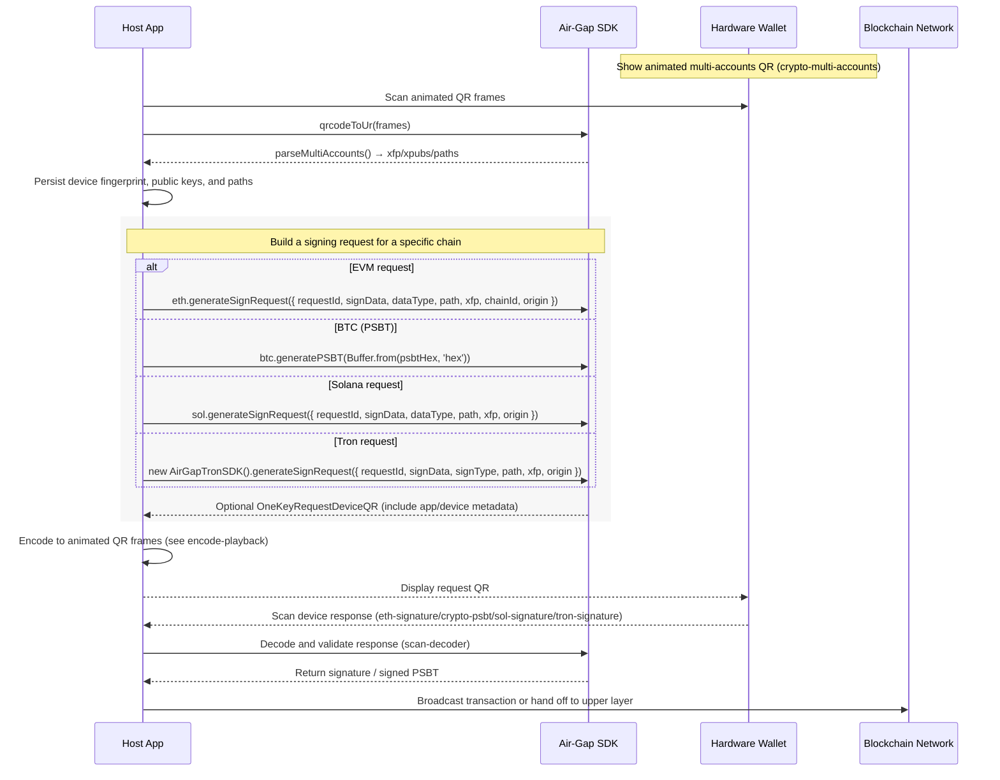

# Air‑Gap Workflow (Sequence Diagram)

The diagram below uses Mermaid to show the complete offline signing (Air‑Gap) flow. GitBook and GitHub both natively render Mermaid code blocks.

---

Appendix: Step list aligned with the demo flow (for quick textual recap).

1) Import device context
- Scan the animated `crypto-multi-accounts` QR from the hardware wallet.
- Aggregate frames with `qrcodeToUr()` and parse via `getAirGapSdk().parseMultiAccounts()`.
- Persist device fingerprint (xfp), xpubs, public keys, and derivation paths.

2) Build a signing request (per chain)
- EVM: `getAirGapSdk().eth.generateSignRequest({ requestId, signData, dataType, path, xfp, chainId, origin })`
- BTC: `getAirGapSdk().btc.generatePSBT(Buffer.from(psbtHex, 'hex'))`
- SOL: `getAirGapSdk().sol.generateSignRequest({ requestId, signData, dataType, path, xfp, origin })`
- TRON: `new AirGapTronSDK().generateSignRequest({ requestId, signData, signType, path, xfp, origin })`
- Optional: wrap with `OneKeyRequestDeviceQR` to include app/device metadata.

3) Display the request as animated QR
- See: `guide/code-demos/encode-playback.md` for frame generation and playback.

4) Scan device response
- See: `guide/code-demos/scan-decoder.md` for camera + decoder setup.
- Handle typed results such as `eth-signature`, `crypto-psbt`, `sol-signature`, `tron-signature`.

5) Broadcast or hand off
- Submit signed payloads using your network stack, or return to the host app for verification.
