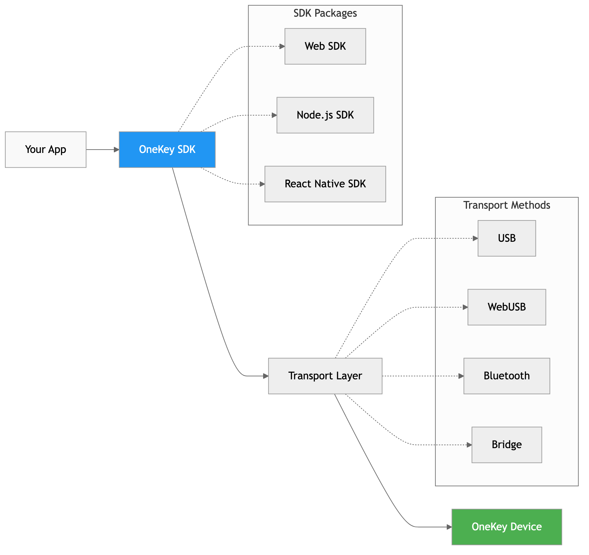

# What is OneKey SDK

OneKey SDK is a JavaScript library that enables developers to integrate OneKey hardware wallets into their applications. It provides a secure, standardized way to interact with hardware wallets across different platforms and environments.

## Core Architecture

OneKey SDK follows a layered architecture designed for security, flexibility, and ease of use:



### Application Layer
Your application code that calls OneKey SDK methods to perform operations like getting addresses or signing transactions.

### SDK Layer
The OneKey SDK that provides a unified API across different platforms:
- `@onekey/hardware-web-sdk` - For web browsers
- `@onekey/hardware-js-sdk` - For Node.js and Electron
- `@onekey/hardware-react-native-sdk` - For React Native apps

### Transport Layer
The communication layer that handles different connection methods:
- **WebUSB** - Direct browser-to-device communication
- **USB/HID** - Direct USB communication (Node.js)
- **Bluetooth** - Wireless communication (mobile/desktop)
- **Bridge** - OneKey Bridge application proxy
- **Deep Link** - Mobile app integration

### Hardware Layer
OneKey hardware devices that store private keys and perform cryptographic operations.

## Key Concepts

### Manifest
Every OneKey SDK integration requires a manifest that identifies your application:

```javascript
{
  email: 'developer@yourapp.com',    // Your contact email
  appName: 'Your Application',       // Application name
  appUrl: 'https://yourapp.com'      // Application URL
}
```

The manifest serves multiple purposes:
- **Device Display** - Shows your app name on the device screen
- **Security** - Helps users verify they're interacting with the correct app
- **Support** - Allows OneKey to contact you if needed

### Derivation Paths
OneKey SDK uses BIP32/BIP44 derivation paths to generate addresses:

```javascript
"m/44'/0'/0'/0/0"  // Bitcoin first address
"m/44'/60'/0'/0/0" // Ethereum first address
```

Path components:
- `m` - Master key
- `44'` - BIP44 standard (hardened)
- `0'` - Coin type (hardened)
- `0'` - Account index (hardened)
- `0` - Change index (external addresses)
- `0` - Address index

### Response Format
All OneKey SDK methods return a consistent response format:

```javascript
// Success response
{
  success: true,
  payload: {
    address: "bc1q...",
    path: "m/44'/0'/0'/0/0"
  }
}

// Error response
{
  success: false,
  payload: {
    error: "Device not found",
    code: "Device_NotFound"
  }
}
```

### Events
OneKey SDK emits events for device state changes and user interactions:

```javascript
sdk.on('device-connect', (device) => {
  console.log('Device connected:', device);
});

sdk.on('device-disconnect', () => {
  console.log('Device disconnected');
});
```

## Security Model

### Hardware Security
- **Private keys never leave the device** - All cryptographic operations happen on the hardware
- **User confirmation required** - Critical operations require physical confirmation on the device
- **Secure element** - Keys are stored in tamper-resistant hardware

### Transport Security
- **Encrypted communication** - All data between SDK and device is encrypted
- **Authentication** - Device authenticity is verified before operations
- **Isolation** - Web environments use secure iframe/popup isolation

### Application Security
- **Manifest verification** - Applications must provide valid identification
- **Permission model** - Users explicitly grant permissions for operations
- **Audit trail** - All operations are logged for security review

## Platform Differences

### Web Browser
- **Automatic transport selection** - SDK chooses the best available connection method
- **Security restrictions** - Limited by browser security policies
- **User-friendly** - No additional software installation required (with WebUSB)

### Node.js
- **Full feature access** - Complete SDK functionality available
- **Direct device communication** - No browser limitations
- **System permissions** - May require elevated permissions for device access

### React Native
- **Mobile optimized** - Designed for mobile device constraints
- **Bluetooth focus** - Primary connection method for mobile devices
- **Deep link integration** - Seamless integration with OneKey mobile app

## Best Practices

### Initialization
- Initialize SDK once and reuse the instance
- Always provide a valid manifest
- Handle initialization errors gracefully

### Error Handling
- Always check the `success` field in responses
- Implement proper error handling for all operations
- Provide user-friendly error messages

### User Experience
- Show clear loading states during operations
- Provide helpful instructions for device interactions
- Handle user cancellations gracefully

### Security
- Never log sensitive information
- Validate all inputs before sending to the device
- Use `showOnDevice: true` for address verification

## Next Steps

Now that you understand the core concepts, explore specific topics:

- [Transport Layer](transport.md) - Deep dive into connection methods
- [Derivation Paths](paths.md) - Understanding address generation
- [Events System](events.md) - Handling device events
- [Error Handling](errors.md) - Comprehensive error management

Or jump into platform-specific guides:

- [Web Integration](../platforms/web.md)
- [Node.js Integration](../platforms/nodejs.md)
- [React Native Integration](../platforms/react-native.md)
