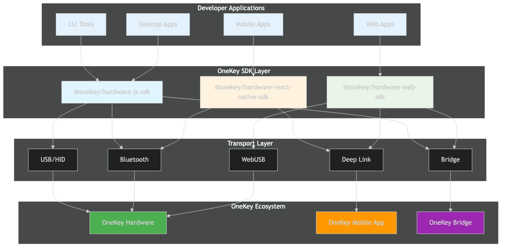

# Transport Layer

The transport layer is the communication bridge between OneKey SDK and hardware devices. Understanding transport options helps you choose the best connection method for your application.

## Overview

OneKey SDK supports multiple transport methods to ensure maximum compatibility across different platforms and environments:



## Transport Types

### USB/HID Transport

**Direct USB communication for desktop applications**

**Platforms**: Node.js, Electron Main Process  
**Advantages**: Fast, reliable, no additional software required  
**Requirements**: System-level USB access permissions

```javascript
const sdk = new OneKeySDK({
  transport: {
    type: 'usb',
    timeout: 5000
  },
  manifest: { /* ... */ }
});
```

**Use Cases**:
- Desktop applications
- CLI tools
- Server applications
- Development tools

### WebUSB Transport

**Direct browser-to-device communication**

**Platforms**: Chrome, Edge, Opera (60+)  
**Advantages**: No additional software, secure, fast  
**Requirements**: HTTPS, supported browser

```javascript
// Automatic in web SDK
const sdk = new OneKeySDK({
  manifest: { /* ... */ }
});

// Check WebUSB support
if ('usb' in navigator) {
  console.log('WebUSB supported');
}
```

**Use Cases**:
- Web applications
- Progressive Web Apps
- Browser-based tools

### Bluetooth Transport

**Wireless device communication**

**Platforms**: Node.js, React Native, some browsers  
**Advantages**: Wireless, mobile-friendly  
**Requirements**: Bluetooth permissions, device pairing

```javascript
const sdk = new OneKeySDK({
  transport: {
    type: 'bluetooth',
    timeout: 10000
  },
  manifest: { /* ... */ }
});
```

**Use Cases**:
- Mobile applications
- Wireless desktop apps
- IoT applications

### Bridge Transport

**Proxy through OneKey Bridge application**

**Platforms**: All platforms  
**Advantages**: Universal compatibility, fallback option  
**Requirements**: OneKey Bridge installation

```javascript
const sdk = new OneKeySDK({
  transport: {
    type: 'bridge',
    bridgeUrl: 'http://localhost:21325'
  },
  manifest: { /* ... */ }
});
```

**Use Cases**:
- Unsupported browsers (Firefox, Safari)
- Legacy applications
- Fallback scenarios

### Deep Link Transport

**Integration via OneKey mobile app**

**Platforms**: Mobile browsers, React Native  
**Advantages**: No device pairing required, universal mobile support  
**Requirements**: OneKey mobile app installation

```javascript
const sdk = new OneKeySDK({
  deeplinkOpen: (url) => window.open(url),
  deeplinkCallbackUrl: 'https://yourapp.com/callback',
  manifest: { /* ... */ }
});
```

**Use Cases**:
- Mobile web applications
- Cross-platform mobile apps
- Simplified mobile integration

## Transport Selection

### Automatic Selection

OneKey SDK can automatically choose the best transport:

```javascript
const sdk = new OneKeySDK({
  transport: {
    type: 'auto' // Automatic selection
  },
  manifest: { /* ... */ }
});
```

**Selection Priority**:
1. **WebUSB** (if supported and available)
2. **USB/HID** (Node.js environments)
3. **Bluetooth** (if configured and available)
4. **Bridge** (if running and accessible)
5. **Deep Link** (mobile fallback)

### Manual Selection

Choose specific transport for your use case:

```javascript
// Force USB transport
const sdk = new OneKeySDK({
  transport: { type: 'usb' },
  manifest: { /* ... */ }
});

// Force Bridge transport
const sdk = new OneKeySDK({
  transport: { 
    type: 'bridge',
    bridgeUrl: 'http://localhost:21325'
  },
  manifest: { /* ... */ }
});
```

## Platform-Specific Behavior

### Web Browser

```javascript
// Web SDK automatically handles transport selection
const sdk = new OneKeySDK({
  manifest: { /* ... */ }
});

// Transport selection logic:
// 1. Check WebUSB support
// 2. Check Bridge availability
// 3. Fallback to Deep Link (mobile)
```

### Node.js

```javascript
// Node.js SDK supports all transports
const sdk = new OneKeySDK({
  transport: {
    type: 'auto', // or 'usb', 'bluetooth', 'bridge'
    timeout: 5000
  },
  manifest: { /* ... */ }
});
```

### React Native

```javascript
// React Native SDK uses Bluetooth and Deep Link
const sdk = new OneKeySDK({
  // Bluetooth is primary transport
  // Deep Link is automatic fallback
  deeplinkOpen: (url) => Linking.openURL(url),
  deeplinkCallbackUrl: 'yourapp://callback',
  manifest: { /* ... */ }
});
```

## Transport Configuration

### Timeouts

Configure connection and operation timeouts:

```javascript
const sdk = new OneKeySDK({
  transport: {
    type: 'usb',
    timeout: 5000 // Connection timeout
  },
  timeout: {
    call: 30000,      // Method call timeout
    transport: 5000,  // Transport connection timeout
    device: 10000     // Device response timeout
  },
  manifest: { /* ... */ }
});
```

### Retry Logic

Configure retry behavior for failed connections:

```javascript
const sdk = new OneKeySDK({
  retry: {
    count: 3,         // Number of retries
    delay: 1000       // Delay between retries (ms)
  },
  manifest: { /* ... */ }
});
```

### Custom Bridge URL

Configure custom Bridge service:

```javascript
const sdk = new OneKeySDK({
  transport: {
    type: 'bridge',
    bridgeUrl: 'http://custom-bridge:21325'
  },
  manifest: { /* ... */ }
});
```

## Transport Events

Monitor transport state changes:

```javascript
sdk.on('transport-connect', (transport) => {
  console.log('Transport connected:', transport.type);
});

sdk.on('transport-disconnect', (transport) => {
  console.log('Transport disconnected:', transport.type);
});

sdk.on('transport-error', (error) => {
  console.log('Transport error:', error.message);
});
```

## Error Handling

Handle transport-specific errors:

```javascript
try {
  await sdk.connectDevice(devicePath);
} catch (error) {
  switch (error.code) {
    case 'Transport_Missing':
      console.error('Transport not available');
      // Guide user to install Bridge or use supported browser
      break;
    case 'Transport_Timeout':
      console.error('Connection timeout');
      // Retry or suggest checking device connection
      break;
    case 'Transport_Permission':
      console.error('Permission denied');
      // Guide user to grant permissions
      break;
    case 'Transport_Busy':
      console.error('Transport busy');
      // Wait and retry
      break;
    default:
      console.error('Unknown transport error:', error.message);
  }
}
```

## Best Practices

### Transport Selection
- Use automatic selection for maximum compatibility
- Provide fallback options for critical applications
- Test all transport methods in your target environment

### Error Handling
- Implement graceful degradation for transport failures
- Provide clear user guidance for transport issues
- Monitor transport events for connection state

### Performance
- Cache transport connections when possible
- Use appropriate timeouts for your use case
- Implement connection pooling for high-frequency operations

### Security
- Validate transport security in production
- Use HTTPS for WebUSB and Bridge connections
- Implement proper permission handling

## Troubleshooting

### USB/HID Issues
- **Linux**: Configure udev rules for device access
- **Windows**: Ensure drivers are installed
- **macOS**: Check system permissions

### WebUSB Issues
- **HTTPS Required**: Ensure secure context
- **Browser Support**: Use supported browsers
- **Permissions**: Handle user permission prompts

### Bluetooth Issues
- **Permissions**: Request Bluetooth permissions
- **Pairing**: Ensure device is discoverable
- **Range**: Check device proximity

### Bridge Issues
- **Installation**: Verify Bridge is installed and running
- **Firewall**: Check firewall settings
- **Port**: Ensure port 21325 is available

### Deep Link Issues
- **App Installation**: Verify OneKey app is installed
- **URL Scheme**: Configure proper URL handling
- **Callback**: Implement callback URL handling

## Next Steps

- [Derivation Paths](paths.md) - Understanding address generation
- [Events System](events.md) - Handling device events
- [Error Handling](errors.md) - Comprehensive error management
- [Platform Guides](../platforms/web.md) - Platform-specific implementation
