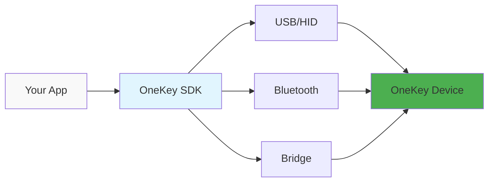
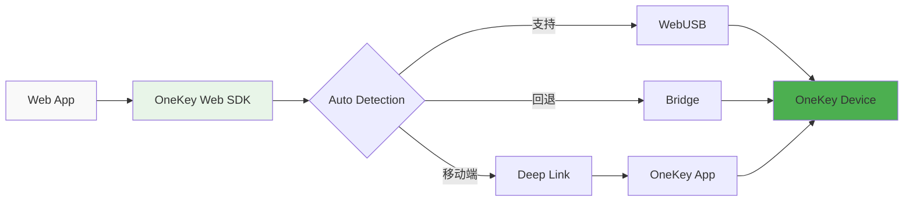
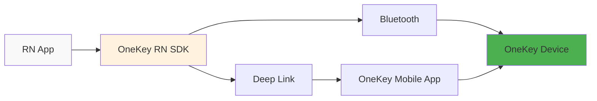

# 环境选择指南


选择正确的 OneKey SDK 包是成功集成的第一步。本指南将帮助你根据开发环境选择最适合的 SDK。


## 🤔 我应该选择哪个包？

### 快速决策流程图

```mermaid
graph TD
    A[开始集成 OneKey SDK] --> B{你的开发环境是什么？}
    
    B -->|Node.js 应用| C[Node.js/Electron Main]
    B -->|Web 浏览器应用| D[Web Browser]
    B -->|移动应用| E[React Native]
    B -->|浏览器扩展| F[Browser Extension]
    
    C --> C1[@onekey/hardware-js-sdk]
    D --> D1[@onekey/hardware-web-sdk]
    E --> E1[@onekey/hardware-react-native-sdk]
    F --> F1[@onekey/hardware-web-sdk]
    
    style C1 fill:#e1f5fe,stroke:#01579b,stroke-width:2px
    style D1 fill:#e8f5e8,stroke:#2e7d32,stroke-width:2px
    style E1 fill:#fff3e0,stroke:#ef6c00,stroke-width:2px
    style F1 fill:#f3e5f5,stroke:#7b1fa2,stroke-width:2px
```

### 详细对比表

| 环境 | 推荐包 | 连接方式 | 优势 | 限制 |
|------|--------|----------|------|------|
| **Node.js 服务器** | `@onekey/hardware-js-sdk` | USB/HID, Bluetooth, Bridge | 直接设备访问，完整功能 | 需要系统权限 |
| **Electron 主进程** | `@onekey/hardware-js-sdk` | USB/HID, Bluetooth, Bridge | 原生性能，完整 API | 主进程限制 |
| **Web 应用** | `@onekey/hardware-web-sdk` | WebUSB, Bridge, Deep Link | 浏览器兼容，自动回退 | 浏览器安全限制 |
| **React Native** | `@onekey/hardware-react-native-sdk` | Bluetooth, Deep Link | 移动端优化，原生体验 | 平台权限要求 |
| **Electron 渲染进程** | `@onekey/hardware-web-sdk` | WebUSB, Bridge | 安全隔离，Web 兼容 | 功能受限 |
| **浏览器扩展** | `@onekey/hardware-web-sdk` | WebUSB, Bridge | 扩展兼容，轻量级 | 扩展权限限制 |

## 📋 环境特性详解

### 🖥️ Node.js/Electron Main

**最适合**：
- 桌面应用程序
- 命令行工具
- 服务器端应用
- Electron 主进程

**特点**：
- ✅ 完整的 SDK 功能
- ✅ 直接设备通信
- ✅ 支持所有 Transport 协议
- ✅ 最佳性能表现
- ⚠️ 需要系统级权限

**连接方式**：


### 🌐 Web Browser

**最适合**：
- React/Vue/Angular 应用
- 单页应用 (SPA)
- 渐进式 Web 应用 (PWA)
- 静态网站

**特点**：
- 🔄 自动检测最佳连接方式
- 🌐 跨浏览器兼容
- 📱 移动端自动回退
- 🔒 安全的沙盒环境
- ⚠️ 受浏览器安全策略限制

**连接方式**：


### 📱 React Native

**最适合**：
- iOS/Android 移动应用
- 跨平台移动应用
- 混合应用

**特点**：
- 📱 移动端专门优化
- 🔵 原生 Bluetooth 支持
- 🔗 Deep Link 集成
- ⚡ 原生性能
- ⚠️ 需要移动端权限配置

**连接方式**：


### 🔌 Browser Extension

**最适合**：
- Chrome/Firefox 扩展
- Web Extension
- 浏览器插件

**特点**：
- 🔌 扩展环境优化
- 🔒 安全权限管理
- 📦 轻量级集成
- 🌐 跨浏览器支持
- ⚠️ 扩展权限限制

## 🎯 选择建议

### 如果你是...

**🆕 新手开发者**
- 推荐从 **Web Browser** 开始
- 使用 `@onekey/hardware-web-sdk`
- 快速上手，无需复杂配置

**🏢 企业级应用**
- 推荐 **Node.js** 方案
- 使用 `@onekey/hardware-js-sdk`
- 完整功能，最佳性能

**📱 移动应用开发者**
- 必须使用 **React Native**
- 使用 `@onekey/hardware-react-native-sdk`
- 原生移动体验

**🔧 桌面应用开发者**
- 推荐 **Electron** 方案
- 主进程用 `@onekey/hardware-js-sdk`
- 渲染进程用 `@onekey/hardware-web-sdk`

## 🚀 下一步

选择好环境后，查看对应的详细指南：



[Node.js 集成指南](../environments/nodejs.md)



[Web Browser 集成指南](../environments/web-browser.md)



[React Native 集成指南](../environments/react-native.md)



[Browser Extension 集成指南](../environments/browser-extension.md)




**还有疑问？** 查看我们的 [常见问题](../guides/faq.md) 或在 [GitHub Issues](https://github.com/OneKeyHQ/hardware-js-sdk/issues) 中提问。

