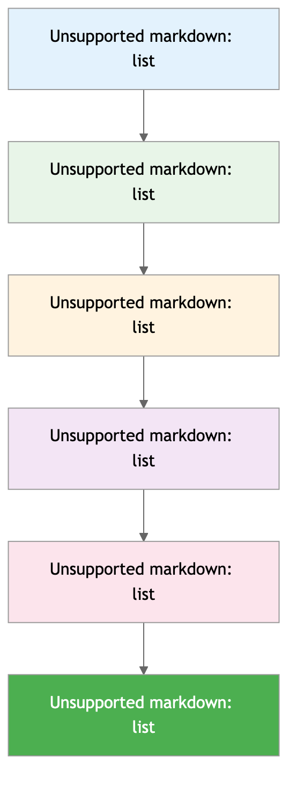

# Quick Start

Get up and running with OneKey SDK in minutes. This guide will walk you through your first integration.

## Prerequisites

- OneKey hardware device
- Node.js 16+ or modern browser
- Basic JavaScript knowledge

## Choose Your Platform

Select your development environment to get started:


## Integration Steps





### 1. Install Package

```bash
npm install @onekey/hardware-web-sdk
```

### 2. Initialize SDK

```javascript
import OneKeySDK from '@onekey/hardware-web-sdk';

const sdk = new OneKeySDK({
  manifest: {
    email: 'developer@yourapp.com',
    appName: 'Your Web App',
    appUrl: 'https://yourapp.com'
  }
});
```

### 3. Get Address

```javascript
const result = await sdk.btcGetAddress({
  path: "m/44'/0'/0'/0/0",
  showOnDevice: true,
  coin: 'btc'
});

if (result.success) {
  console.log('Bitcoin address:', result.payload.address);
}
```

### 4. Try It Live

🚀 **[Test in Playground](https://hardware-example.onekeytest.com/expo-playground/)**

[Complete Web Guide →](../platforms/web.md)



### 1. Install Package

```bash
npm install @onekey/hardware-js-sdk
```

### 2. Initialize SDK

```javascript
const OneKeySDK = require('@onekey/hardware-js-sdk');

const sdk = new OneKeySDK({
  manifest: {
    email: 'developer@yourapp.com',
    appName: 'Your Node App',
    appUrl: 'https://yourapp.com'
  }
});
```

### 3. Connect Device

```javascript
// Search for devices
const devices = await sdk.searchDevices();
await sdk.connectDevice(devices[0].path);
```

### 4. Get Address

```javascript
const result = await sdk.btcGetAddress({
  path: "m/44'/0'/0'/0/0",
  showOnDevice: true,
  coin: 'btc'
});

if (result.success) {
  console.log('Bitcoin address:', result.payload.address);
}
```

[Complete Node.js Guide →](../platforms/nodejs.md)



### 1. Install Package

```bash
npm install @onekey/hardware-react-native-sdk
```

### 2. Configure Permissions

**iOS** (`ios/YourApp/Info.plist`):
```xml
<key>NSBluetoothAlwaysUsageDescription</key>
<string>Connect to OneKey devices</string>
```

**Android** (`android/app/src/main/AndroidManifest.xml`):
```xml
<uses-permission android:name="android.permission.BLUETOOTH" />
<uses-permission android:name="android.permission.BLUETOOTH_ADMIN" />
```

### 3. Initialize SDK

```javascript
import OneKeySDK from '@onekey/hardware-react-native-sdk';
import { Linking } from 'react-native';

const sdk = new OneKeySDK({
  manifest: {
    email: 'developer@yourapp.com',
    appName: 'Your Mobile App',
    appUrl: 'https://yourapp.com'
  },
  deeplinkOpen: (url) => Linking.openURL(url),
  deeplinkCallbackUrl: 'yourapp://onekey-callback'
});
```

### 4. Get Address

```javascript
const result = await sdk.btcGetAddress({
  path: "m/44'/0'/0'/0/0",
  showOnDevice: true,
  coin: 'btc'
});

if (result.success) {
  console.log('Bitcoin address:', result.payload.address);
}
```

[Complete React Native Guide →](../platforms/react-native.md)



## 📝 Step 1: 创建项目



```bash
# 创建新项目
mkdir onekey-demo
cd onekey-demo
npm init -y

# 安装 SDK
npm install @onekey/hardware-js-sdk
```

创建 `index.js`:
```javascript
const OneKeySDK = require('@onekey/hardware-js-sdk');

async function main() {
    console.log('OneKey SDK Demo');
}

main().catch(console.error);
```



创建 `index.html`:
```html
<!DOCTYPE html>
<html lang="en">
<head>
    <meta charset="UTF-8">
    <meta name="viewport" content="width=device-width, initial-scale=1.0">
    <title>OneKey SDK Demo</title>
</head>
<body>
    <h1>OneKey SDK Demo</h1>
    <button id="connect">连接设备</button>
    <button id="getAddress">获取地址</button>
    <div id="result"></div>

    <script src="https://unpkg.com/@onekey/hardware-web-sdk"></script>
    <script>
        console.log('OneKey SDK loaded');
    </script>
</body>
</html>
```



```bash
# 创建 React Native 项目
npx react-native init OneKeyDemo
cd OneKeyDemo

# 安装 SDK
npm install @onekey/hardware-react-native-sdk
```

修改 `App.js`:
```javascript
import React from 'react';
import { View, Text, Button } from 'react-native';

const App = () => {
  return (
    <View style={{ flex: 1, justifyContent: 'center', alignItems: 'center' }}>
      <Text>OneKey SDK Demo</Text>
    </View>
  );
};

export default App;
```



## 🔧 Step 2: 初始化 SDK



```javascript
const OneKeySDK = require('@onekey/hardware-js-sdk');

// 初始化 SDK
const sdk = new OneKeySDK({
    debug: true, // 开发环境启用调试
    manifest: {
        email: 'your-email@example.com',
        appName: 'OneKey Demo',
        appUrl: 'https://your-app.com'
    }
});

async function main() {
    console.log('SDK 初始化完成');
    
    // 在这里添加更多代码...
}

main().catch(console.error);
```



```html
<script>
    // 初始化 SDK
    const sdk = new OneKeySDK({
        debug: true,
        connectSrc: 'https://connect.onekey.so/',
        manifest: {
            email: 'your-email@example.com',
            appName: 'OneKey Demo',
            appUrl: window.location.origin
        }
    });

    console.log('SDK 初始化完成');
</script>
```



```javascript
import OneKeySDK from '@onekey/hardware-react-native-sdk';
import { Linking } from 'react-native';

// 初始化 SDK
const sdk = new OneKeySDK({
    debug: true,
    manifest: {
        email: 'your-email@example.com',
        appName: 'OneKey Demo',
        appUrl: 'https://your-app.com'
    },
    deeplinkOpen: (url) => {
        Linking.openURL(url);
    },
    deeplinkCallbackUrl: 'onekeydemo://onekey-callback'
});

console.log('SDK 初始化完成');
```




**重要**：请将 `your-email@example.com` 替换为你的真实邮箱地址。这有助于我们在需要时联系你。


## 🔌 Step 3: 连接设备



```javascript
async function connectDevice() {
    try {
        console.log('搜索设备...');
        
        // 搜索可用设备
        const devices = await sdk.searchDevices();
        
        if (devices.length === 0) {
            console.log('未找到设备，请确保设备已连接');
            return null;
        }
        
        console.log(`找到 ${devices.length} 个设备`);
        
        // 连接第一个设备
        const device = devices[0];
        await sdk.connectDevice(device.path);
        
        console.log('设备连接成功！');
        return device;
        
    } catch (error) {
        console.error('连接设备失败:', error.message);
        return null;
    }
}

// 在 main 函数中调用
async function main() {
    console.log('SDK 初始化完成');
    
    const device = await connectDevice();
    if (!device) {
        return;
    }
    
    // 继续下一步...
}
```



```html
<script>
    async function connectDevice() {
        try {
            console.log('连接设备...');
            
            // Web 环境下，SDK 会自动处理设备连接
            // 只需要调用任何方法，SDK 会自动连接
            const features = await sdk.getFeatures();
            
            console.log('设备连接成功！', features);
            return true;
            
        } catch (error) {
            console.error('连接设备失败:', error.message);
            document.getElementById('result').innerHTML = 
                `<p style="color: red;">连接失败: ${error.message}</p>`;
            return false;
        }
    }

    // 绑定按钮事件
    document.getElementById('connect').addEventListener('click', connectDevice);
</script>
```



```javascript
import React, { useEffect } from 'react';
import { View, Text, Button, Alert } from 'react-native';
import { Linking } from 'react-native';

const App = () => {
    // 处理深度链接回调
    useEffect(() => {
        const subscription = Linking.addEventListener('url', (event) => {
            sdk.handleDeeplink(event.url);
        });

        return () => subscription?.remove();
    }, []);

    const connectDevice = async () => {
        try {
            console.log('连接设备...');
            
            // React Native 环境下，调用方法会自动处理连接
            const features = await sdk.getFeatures();
            
            console.log('设备连接成功！', features);
            Alert.alert('成功', '设备连接成功！');
            
        } catch (error) {
            console.error('连接设备失败:', error.message);
            Alert.alert('错误', `连接失败: ${error.message}`);
        }
    };

    return (
        <View style={{ flex: 1, justifyContent: 'center', alignItems: 'center' }}>
            <Text style={{ fontSize: 24, marginBottom: 20 }}>OneKey SDK Demo</Text>
            <Button title="连接设备" onPress={connectDevice} />
        </View>
    );
};
```



## 💰 Step 4: 获取地址



```javascript
async function getAddress() {
    try {
        console.log('获取比特币地址...');
        
        const result = await sdk.btcGetAddress({
            path: "m/44'/0'/0'/0/0", // BIP44 标准路径
            showOnDevice: true,      // 在设备上显示地址
            coin: 'btc'             // 比特币
        });
        
        if (result.success) {
            console.log('地址:', result.payload.address);
            console.log('路径:', result.payload.path);
            return result.payload.address;
        } else {
            console.error('获取地址失败:', result.payload.error);
            return null;
        }
        
    } catch (error) {
        console.error('获取地址出错:', error.message);
        return null;
    }
}

// 完整的 main 函数
async function main() {
    console.log('SDK 初始化完成');
    
    const device = await connectDevice();
    if (!device) {
        return;
    }
    
    const address = await getAddress();
    if (address) {
        console.log('🎉 成功获取地址:', address);
    }
}
```



```html
<script>
    async function getAddress() {
        try {
            console.log('获取比特币地址...');
            
            const result = await sdk.btcGetAddress({
                path: "m/44'/0'/0'/0/0",
                showOnDevice: true,
                coin: 'btc'
            });
            
            if (result.success) {
                const address = result.payload.address;
                console.log('地址:', address);
                
                document.getElementById('result').innerHTML = 
                    `<p style="color: green;">✅ 地址: ${address}</p>`;
                
                return address;
            } else {
                throw new Error(result.payload.error);
            }
            
        } catch (error) {
            console.error('获取地址失败:', error.message);
            document.getElementById('result').innerHTML = 
                `<p style="color: red;">❌ 获取地址失败: ${error.message}</p>`;
            return null;
        }
    }

    // 绑定按钮事件
    document.getElementById('getAddress').addEventListener('click', getAddress);
</script>
```



```javascript
const App = () => {
    const [address, setAddress] = useState('');

    const getAddress = async () => {
        try {
            console.log('获取比特币地址...');
            
            const result = await sdk.btcGetAddress({
                path: "m/44'/0'/0'/0/0",
                showOnDevice: true,
                coin: 'btc'
            });
            
            if (result.success) {
                const addr = result.payload.address;
                console.log('地址:', addr);
                setAddress(addr);
                Alert.alert('成功', `地址: ${addr}`);
            } else {
                throw new Error(result.payload.error);
            }
            
        } catch (error) {
            console.error('获取地址失败:', error.message);
            Alert.alert('错误', `获取地址失败: ${error.message}`);
        }
    };

    return (
        <View style={{ flex: 1, justifyContent: 'center', alignItems: 'center', padding: 20 }}>
            <Text style={{ fontSize: 24, marginBottom: 20 }}>OneKey SDK Demo</Text>
            <Button title="连接设备" onPress={connectDevice} />
            <Button title="获取地址" onPress={getAddress} />
            {address ? (
                <Text style={{ marginTop: 20, fontSize: 12 }}>
                    地址: {address}
                </Text>
            ) : null}
        </View>
    );
};
```



## 🏃‍♂️ Step 5: 运行测试



```bash
# 运行代码
node index.js
```

**预期输出**：
```
SDK 初始化完成
搜索设备...
找到 1 个设备
设备连接成功！
获取比特币地址...
地址: bc1qxy2kgdygjrsqtzq2n0yrf2493p83kkfjhx0wlh
路径: m/44'/0'/0'/0/0
🎉 成功获取地址: bc1qxy2kgdygjrsqtzq2n0yrf2493p83kkfjhx0wlh
```



```bash
# 启动本地服务器
npx serve .
# 或使用 Python
python -m http.server 8000
```

在浏览器中打开 `http://localhost:8000`，点击按钮测试功能。



```bash
# iOS
npx react-native run-ios

# Android
npx react-native run-android
```



## 🎉 恭喜！

你已经成功完成了 OneKey SDK 的基础集成！现在你可以：

✅ 连接 OneKey 硬件设备  
✅ 获取比特币地址  
✅ 处理基本的错误情况  

## 🚀 下一步

现在你已经掌握了基础用法，可以继续学习：

<table data-view="cards"><thead><tr><th></th><th></th><th></th><th data-hidden data-card-target data-type="content-ref"></th></tr></thead><tbody><tr><td><strong>🔧 API 参考</strong></td><td>学习更多 SDK 方法</td><td></td><td><a href="../api-reference/">api-reference</a></td></tr><tr><td><strong>🏗️ 高级功能</strong></td><td>Transport 层和错误处理</td><td></td><td><a href="../advanced/">advanced</a></td></tr><tr><td><strong>📖 完整示例</strong></td><td>查看更多实际应用案例</td><td></td><td><a href="../examples/">examples</a></td></tr><tr><td><strong>💡 最佳实践</strong></td><td>开发建议和安全指南</td><td></td><td><a href="../guides/best-practices.md">best-practices.md</a></td></tr></tbody></table>

## 🆘 遇到问题？

如果在快速开始过程中遇到问题：

1. 📖 查看 [故障排除指南](../guides/troubleshooting.md)
2. 💬 在 [GitHub Issues](https://github.com/OneKeyHQ/hardware-js-sdk/issues) 提问
3. 💌 发邮件到 [developer@onekey.so](mailto:developer@onekey.so)


**太棒了！** 你已经成功入门 OneKey SDK。继续探索更多功能吧！

