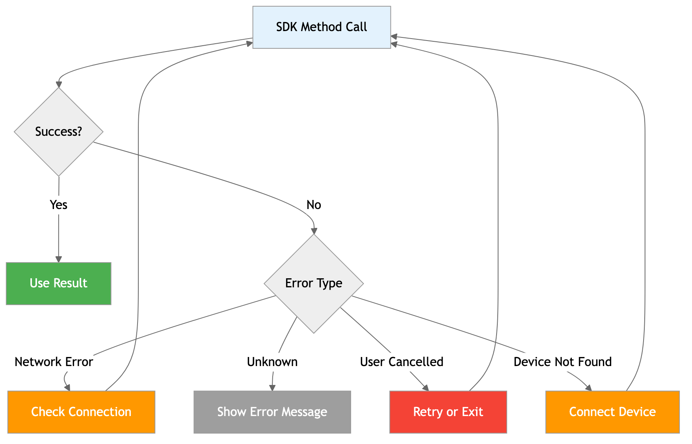

# Troubleshooting

Common issues and solutions when working with OneKey SDK.

## Error Handling Flow



## Common Issues

### 📦 安装问题

#### 问题：npm install 失败

**症状**：
```bash
npm ERR! code EACCES
npm ERR! syscall open
npm ERR! path /usr/local/lib/node_modules/@onekey/hardware-js-sdk
npm ERR! errno -13
```

**解决方案**：
```bash
# 方案 1：使用 npx (推荐)
npx create-react-app my-app
cd my-app
npm install @onekey/hardware-web-sdk

# 方案 2：配置 npm 全局目录
mkdir ~/.npm-global
npm config set prefix '~/.npm-global'
echo 'export PATH=~/.npm-global/bin:$PATH' >> ~/.bashrc
source ~/.bashrc

# 方案 3：使用 yarn
yarn add @onekey/hardware-js-sdk
```

#### 问题：TypeScript 类型错误

**症状**：
```typescript
Cannot find module '@onekey/hardware-js-sdk' or its corresponding type declarations.
```

**解决方案**：
```bash
# 确保安装了最新版本
npm install @onekey/hardware-js-sdk@latest

# 如果仍有问题，手动声明类型
echo "declare module '@onekey/hardware-js-sdk';" > src/onekey.d.ts
```

### 🔌 连接问题

#### 问题：设备未找到

**症状**：
```javascript
{
    success: false,
    payload: {
        error: "Device not found",
        code: "Device_NotFound"
    }
}
```

**解决方案**：



1. **检查设备连接**：
   - 确保 OneKey 设备已连接到电脑
   - 尝试更换 USB 线缆和端口
   - 在设备管理器中查看是否识别设备

2. **安装驱动**：
   ```bash
   # 下载并安装 OneKey Bridge
   # https://onekey.so/bridge
   ```

3. **检查权限**：
   - 以管理员身份运行应用
   - 关闭杀毒软件的实时保护



1. **检查系统权限**：
   - 系统偏好设置 > 安全性与隐私 > 隐私
   - 确保应用有访问 USB 设备的权限

2. **重置 USB 权限**：
   ```bash
   sudo killall -HUP mDNSResponder
   sudo dscacheutil -flushcache
   ```

3. **安装 Bridge**：
   ```bash
   # 使用 Homebrew
   brew install --cask onekey-bridge
   ```



1. **配置 udev 规则**：
   ```bash
   sudo nano /etc/udev/rules.d/51-onekey.rules
   ```
   
   添加内容：
   ```bash
   SUBSYSTEM=="usb", ATTR{idVendor}=="1209", ATTR{idProduct}=="53c1", MODE="0666", GROUP="plugdev"
   SUBSYSTEM=="usb", ATTR{idVendor}=="1209", ATTR{idProduct}=="53c0", MODE="0666", GROUP="plugdev"
   ```

2. **重新加载规则**：
   ```bash
   sudo udevadm control --reload-rules
   sudo udevadm trigger
   ```

3. **添加用户到 plugdev 组**：
   ```bash
   sudo usermod -a -G plugdev $USER
   # 重新登录生效
   ```



#### 问题：WebUSB 不工作

**症状**：
```javascript
TypeError: Cannot read property 'requestDevice' of undefined
```

**解决方案**：

1. **检查浏览器支持**：
   ```javascript
   if ('usb' in navigator) {
       console.log('支持 WebUSB');
   } else {
       console.log('不支持 WebUSB，将使用 Bridge');
   }
   ```

2. **确保 HTTPS 环境**：
   ```javascript
   // 开发环境
   if (location.protocol !== 'https:' && location.hostname !== 'localhost') {
       console.warn('WebUSB 需要 HTTPS 环境');
   }
   ```

3. **检查 CSP 配置**：
   ```html
   <meta http-equiv="Content-Security-Policy" 
         content="connect-src 'self' https://connect.onekey.so;">
   ```

### 🌐 Web 环境问题

#### 问题：iframe 被阻止

**症状**：
```
Refused to display 'https://connect.onekey.so/' in a frame because it set 'X-Frame-Options' to 'deny'.
```

**解决方案**：
```javascript
// 使用 popup 模式替代 iframe
const sdk = new OneKeySDK({
    mode: 'popup', // 强制使用 popup 模式
    manifest: { /* ... */ }
});
```

#### 问题：跨域错误

**症状**：
```
Access to fetch at 'https://connect.onekey.so/' from origin 'https://yourapp.com' has been blocked by CORS policy
```

**解决方案**：
```javascript
// 检查 connectSrc 配置
const sdk = new OneKeySDK({
    connectSrc: 'https://connect.onekey.so/', // 确保使用正确的地址
    manifest: { /* ... */ }
});
```

### 📱 移动端问题

#### 问题：React Native 蓝牙权限

**症状**：
```
[Error] Bluetooth permission denied
```

**解决方案**：

**Android**：
```javascript
import { PermissionsAndroid } from 'react-native';

async function requestPermissions() {
    const permissions = [
        PermissionsAndroid.PERMISSIONS.BLUETOOTH_SCAN,
        PermissionsAndroid.PERMISSIONS.BLUETOOTH_CONNECT,
        PermissionsAndroid.PERMISSIONS.ACCESS_FINE_LOCATION,
    ];
    
    const granted = await PermissionsAndroid.requestMultiple(permissions);
    console.log('权限状态:', granted);
}
```

**iOS**：
```xml
<!-- ios/YourApp/Info.plist -->
<key>NSBluetoothAlwaysUsageDescription</key>
<string>This app needs Bluetooth to connect to OneKey devices</string>
<key>NSBluetoothPeripheralUsageDescription</key>
<string>This app needs Bluetooth to connect to OneKey devices</string>
```

#### 问题：Deep Link 不工作

**症状**：Deep Link 回调没有被处理

**解决方案**：
```javascript
import { Linking } from 'react-native';

// 1. 确保正确配置 URL Scheme
// android/app/src/main/AndroidManifest.xml
/*
<intent-filter>
    <action android:name="android.intent.action.VIEW" />
    <category android:name="android.intent.category.DEFAULT" />
    <category android:name="android.intent.category.BROWSABLE" />
    <data android:scheme="yourapp" />
</intent-filter>
*/

// 2. 正确处理 Deep Link
useEffect(() => {
    const subscription = Linking.addEventListener('url', (event) => {
        console.log('收到 Deep Link:', event.url);
        sdk.handleDeeplink(event.url);
    });

    // 处理应用启动时的 Deep Link
    Linking.getInitialURL().then(url => {
        if (url) {
            console.log('启动时的 Deep Link:', url);
            sdk.handleDeeplink(url);
        }
    });

    return () => subscription?.remove();
}, []);
```

## 🔧 调试技巧

### 1. 启用调试模式

```javascript
const sdk = new OneKeySDK({
    debug: true, // 启用详细日志
    manifest: { /* ... */ }
});
```

### 2. 自定义日志

```javascript
const sdk = new OneKeySDK({
    debug: true,
    logger: {
        log: (message) => {
            console.log(`[OneKey Debug] ${new Date().toISOString()} - ${message}`);
        },
        error: (message) => {
            console.error(`[OneKey Error] ${new Date().toISOString()} - ${message}`);
        }
    },
    manifest: { /* ... */ }
});
```

### 3. 网络请求监控

```javascript
// 监控网络请求 (仅开发环境)
if (process.env.NODE_ENV === 'development') {
    const originalFetch = window.fetch;
    window.fetch = function(...args) {
        console.log('Fetch request:', args);
        return originalFetch.apply(this, args)
            .then(response => {
                console.log('Fetch response:', response);
                return response;
            });
    };
}
```

## 🚨 错误代码参考

### 设备相关错误

| 错误代码 | 描述 | 解决方案 |
|----------|------|----------|
| `Device_NotFound` | 设备未找到 | 检查设备连接和驱动 |
| `Device_Disconnected` | 设备已断开 | 重新连接设备 |
| `Device_Busy` | 设备忙碌 | 等待当前操作完成 |
| `Device_InvalidState` | 设备状态无效 | 重启设备或重新连接 |

### 用户操作错误

| 错误代码 | 描述 | 解决方案 |
|----------|------|----------|
| `User_Cancelled` | 用户取消操作 | 重新尝试操作 |
| `User_PinInvalid` | PIN 码错误 | 输入正确的 PIN 码 |
| `User_PassphraseInvalid` | 密码短语错误 | 输入正确的密码短语 |

### 网络相关错误

| 错误代码 | 描述 | 解决方案 |
|----------|------|----------|
| `Transport_Missing` | Transport 不可用 | 安装 Bridge 或使用支持的浏览器 |
| `Network_Error` | 网络错误 | 检查网络连接 |
| `Connect_Failed` | 连接失败 | 检查 Connect 服务状态 |

## 🔍 诊断工具

### 1. 环境检测脚本

```javascript
async function diagnoseEnvironment() {
    const report = {
        platform: navigator.platform,
        userAgent: navigator.userAgent,
        webusb: 'usb' in navigator,
        https: location.protocol === 'https:',
        localhost: location.hostname === 'localhost'
    };
    
    // 检查 OneKey Bridge
    try {
        const response = await fetch('http://localhost:21325/status');
        report.bridge = response.ok;
    } catch {
        report.bridge = false;
    }
    
    console.log('环境诊断报告:', report);
    return report;
}

// 运行诊断
diagnoseEnvironment();
```

### 2. 设备连接测试

```javascript
async function testDeviceConnection() {
    try {
        console.log('开始设备连接测试...');
        
        // 1. 搜索设备
        const devices = await sdk.searchDevices();
        console.log('找到设备:', devices.length);
        
        if (devices.length === 0) {
            throw new Error('未找到设备');
        }
        
        // 2. 连接设备
        await sdk.connectDevice(devices[0].path);
        console.log('设备连接成功');
        
        // 3. 获取设备信息
        const features = await sdk.getFeatures();
        console.log('设备信息:', features);
        
        // 4. 测试基础功能
        const result = await sdk.btcGetAddress({
            path: "m/44'/0'/0'/0/0",
            showOnDevice: false
        });
        
        if (result.success) {
            console.log('✅ 设备连接测试通过');
        } else {
            console.log('❌ 设备功能测试失败:', result.payload.error);
        }
        
    } catch (error) {
        console.log('❌ 设备连接测试失败:', error.message);
    }
}
```

## 📞 获取帮助

如果以上解决方案都无法解决你的问题，请通过以下方式获取帮助：

### 1. 收集诊断信息

```javascript
function collectDiagnosticInfo() {
    return {
        sdkVersion: sdk.version,
        environment: {
            platform: navigator.platform,
            userAgent: navigator.userAgent,
            url: window.location.href
        },
        error: {
            // 包含具体的错误信息
        },
        steps: [
            // 重现问题的步骤
        ]
    };
}
```

### 2. 联系方式

- **GitHub Issues**: [OneKey SDK Issues](https://github.com/OneKeyHQ/hardware-js-sdk/issues)
- **Discord 社区**: [OneKey Discord](https://discord.gg/onekey)
- **邮件支持**: [developer@onekey.so](mailto:developer@onekey.so)

### 3. 提交问题时请包含

- 操作系统和版本
- 浏览器类型和版本 (Web 环境)
- Node.js 版本 (Node.js 环境)
- SDK 版本
- 完整的错误信息
- 重现步骤
- 相关代码片段


**问题解决了？** 太好了！如果你发现了新的解决方案，欢迎贡献到我们的文档中。

