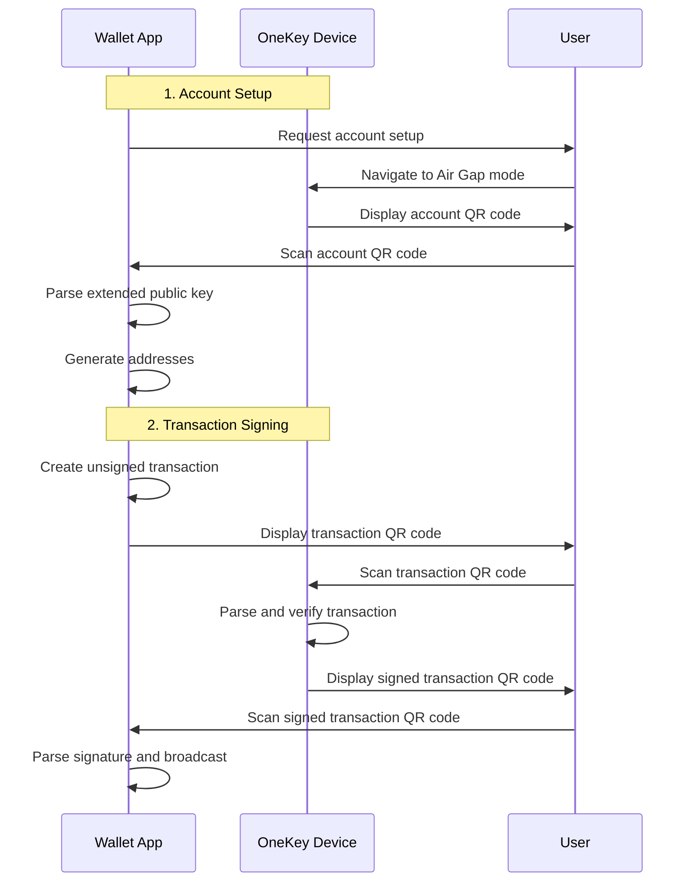

# Air Gap Integration

Complete guide for implementing air-gapped transactions with OneKey hardware wallets using QR code communication.

## Overview

OneKey Air Gap SDK enables completely offline transaction signing through QR code communication, ensuring maximum security by eliminating all electronic connections (USB, Bluetooth, WiFi). This guide covers implementation of QR code workflows, offline transaction preparation, and cold storage patterns.

## Prerequisites

- OneKey Pro device (Air Gap mode support)
- QR code scanning capability (camera)
- QR code display capability (screen)
- Basic knowledge of cryptographic operations

## Installation

### NPM Installation

```bash
npm install @onekeyfe/hd-air-gap-sdk
```

### CDN Installation

```html
<script src="https://unpkg.com/@onekeyfe/hd-air-gap-sdk@latest/dist/index.js"></script>
```

## Core Concepts

### Air Gap Communication Flow



### QR Code Data Types

- **CRYPTO-HDKEY**: Extended public keys for account setup
- **ETH-SIGN-REQUEST**: Ethereum transaction signing requests
- **ETH-SIGNATURE**: Ethereum transaction signatures
- **BTC-SIGN-REQUEST**: Bitcoin transaction signing requests
- **BTC-SIGNATURE**: Bitcoin transaction signatures

## Account Setup and Address Generation

### Scanning Account QR Code

```javascript
import { URDecoder, CryptoHDKey, RegistryTypes } from '@onekeyfe/hd-air-gap-sdk';

class AirGapAccountManager {
  constructor() {
    this.urDecoder = null;
    this.accounts = new Map();
  }

  // Initialize QR code scanning for account setup
  startAccountScan() {
    this.urDecoder = new URDecoder();
    return this.urDecoder;
  }

  // Process scanned QR code data
  processAccountQRCode(qrData) {
    if (!this.urDecoder) {
      throw new Error('Account scan not initialized');
    }

    try {
      this.urDecoder.receivePart(qrData);
      
      if (this.urDecoder.isSuccess()) {
        const result = this.urDecoder.resultUR();
        
        if (result.type === RegistryTypes.CRYPTO_HDKEY.getType()) {
          return this.parseAccountData(result);
        } else {
          throw new Error('Invalid QR code type for account setup');
        }
      } else if (this.urDecoder.isError()) {
        throw new Error('QR code parsing error');
      }
      
      // Need more QR code parts
      return { needsMoreParts: true, progress: this.urDecoder.getProgress() };
    } catch (error) {
      throw new Error(`Failed to process QR code: ${error.message}`);
    }
  }

  // Parse account data from QR code
  parseAccountData(result) {
    const cryptoHDKey = CryptoHDKey.fromCBOR(result.cbor);
    
    const accountInfo = {
      masterFingerprint: cryptoHDKey.getOrigin()?.getSourceFingerprint()?.toString('hex'),
      publicKey: cryptoHDKey.getKey().toString('hex'),
      chainCode: cryptoHDKey.getChainCode()?.toString('hex'),
      path: cryptoHDKey.getOrigin()?.getPath(),
      parentFingerprint: cryptoHDKey.getParentFingerprint()?.toString('hex')
    };

    // Store account for future use
    this.accounts.set(accountInfo.masterFingerprint, accountInfo);
    
    return accountInfo;
  }

  // Generate Ethereum addresses from account data
  generateEthereumAddresses(masterFingerprint, count = 10) {
    const account = this.accounts.get(masterFingerprint);
    if (!account) {
      throw new Error('Account not found');
    }

    const addresses = [];
    const HDKey = require('hdkey');
    
    // Create HD key from account data
    const hdkey = HDKey.fromExtendedKey({
      publicKey: Buffer.from(account.publicKey, 'hex'),
      chainCode: Buffer.from(account.chainCode, 'hex')
    });

    // Generate addresses for the default path m/44'/60'/0'/0/*
    for (let i = 0; i < count; i++) {
      const childKey = hdkey.derive(`m/0/${i}`);
      const publicKey = childKey.publicKey;
      
      // Convert public key to Ethereum address
      const { publicToAddress, toChecksumAddress } = require('@ethereumjs/util');
      const address = publicToAddress(publicKey, true);
      const checksumAddress = toChecksumAddress(address);
      
      addresses.push({
        index: i,
        path: `m/44'/60'/0'/0/${i}`,
        address: checksumAddress,
        publicKey: publicKey.toString('hex')
      });
    }

    return addresses;
  }

  // Generate Bitcoin addresses from account data
  generateBitcoinAddresses(masterFingerprint, count = 10, scriptType = 'p2pkh') {
    const account = this.accounts.get(masterFingerprint);
    if (!account) {
      throw new Error('Account not found');
    }

    const addresses = [];
    const bitcoin = require('bitcoinjs-lib');
    const HDKey = require('hdkey');
    
    const hdkey = HDKey.fromExtendedKey({
      publicKey: Buffer.from(account.publicKey, 'hex'),
      chainCode: Buffer.from(account.chainCode, 'hex')
    });

    for (let i = 0; i < count; i++) {
      const childKey = hdkey.derive(`m/0/${i}`);
      const publicKey = childKey.publicKey;
      
      let address;
      let path;
      
      switch (scriptType) {
        case 'p2pkh': // Legacy (1...)
          path = `m/44'/0'/0'/0/${i}`;
          address = bitcoin.payments.p2pkh({ 
            pubkey: publicKey,
            network: bitcoin.networks.bitcoin 
          }).address;
          break;
          
        case 'p2sh-p2wpkh': // Wrapped SegWit (3...)
          path = `m/49'/0'/0'/0/${i}`;
          address = bitcoin.payments.p2sh({
            redeem: bitcoin.payments.p2wpkh({ 
              pubkey: publicKey,
              network: bitcoin.networks.bitcoin 
            }),
            network: bitcoin.networks.bitcoin
          }).address;
          break;
          
        case 'p2wpkh': // Native SegWit (bc1...)
          path = `m/84'/0'/0'/0/${i}`;
          address = bitcoin.payments.p2wpkh({ 
            pubkey: publicKey,
            network: bitcoin.networks.bitcoin 
          }).address;
          break;
          
        default:
          throw new Error(`Unsupported script type: ${scriptType}`);
      }
      
      addresses.push({
        index: i,
        path,
        address,
        publicKey: publicKey.toString('hex'),
        scriptType
      });
    }

    return addresses;
  }
}

// Usage example
const accountManager = new AirGapAccountManager();

// Start account scanning
const decoder = accountManager.startAccountScan();

// In your QR code scanner callback
function onAccountQRCodeScanned(qrData) {
  try {
    const result = accountManager.processAccountQRCode(qrData);
    
    if (result.needsMoreParts) {
      console.log(`Scanning progress: ${result.progress}%`);
      // Continue scanning for more QR code parts
    } else {
      console.log('Account setup complete:', result);
      
      // Generate addresses
      const ethAddresses = accountManager.generateEthereumAddresses(
        result.masterFingerprint, 
        10
      );
      
      const btcAddresses = accountManager.generateBitcoinAddresses(
        result.masterFingerprint, 
        10, 
        'p2wpkh'
      );
      
      console.log('Ethereum addresses:', ethAddresses);
      console.log('Bitcoin addresses:', btcAddresses);
    }
  } catch (error) {
    console.error('Account QR code processing failed:', error);
  }
}
```

## Transaction Signing

### Ethereum Transaction Signing

```javascript
import { 
  EthSignRequest, 
  DataType, 
  URDecoder, 
  RegistryTypes,
  ETHSignature 
} from '@onekeyfe/hd-air-gap-sdk';
import { Transaction } from '@ethereumjs/tx';
import { Common } from '@ethereumjs/common';

class AirGapEthereumSigner {
  constructor() {
    this.pendingRequests = new Map();
  }

  // Create unsigned transaction QR code
  createTransactionQRCode(transactionParams, accountInfo) {
    const {
      to,
      value,
      gasLimit,
      gasPrice,
      nonce,
      data = '0x',
      chainId = 1
    } = transactionParams;

    // Create transaction object
    const common = Common.custom({ chainId });
    const txData = {
      to,
      value,
      gasLimit,
      gasPrice,
      nonce,
      data
    };

    const tx = Transaction.fromTxData(txData, { common, freeze: false });
    
    // Set signature fields for unsigned transaction
    tx.v = chainId;
    tx.r = 0;
    tx.s = 0;

    const unsignedBuffer = tx.serialize();
    const requestId = this.generateRequestId();
    const addressPath = "m/44'/60'/0'/0/0"; // Adjust based on your needs

    // Create sign request
    const ethSignRequest = EthSignRequest.constructETHRequest(
      unsignedBuffer,
      DataType.transaction,
      addressPath,
      accountInfo.masterFingerprint,
      requestId,
      chainId,
      accountInfo.fromAddress
    );

    // Store request for later verification
    this.pendingRequests.set(requestId, {
      transaction: txData,
      addressPath,
      chainId,
      timestamp: Date.now()
    });

    return {
      requestId,
      qrEncoder: ethSignRequest.toUREncoder(200), // Max 200 chunks per QR
      ethSignRequest
    };
  }

  // Generate animated QR codes for large data
  generateAnimatedQRCodes(qrEncoder) {
    const qrCodes = [];
    
    while (true) {
      const part = qrEncoder.nextPart();
      qrCodes.push(part);
      
      // Check if we've generated all parts
      if (qrCodes.length > 1 && part === qrCodes[0]) {
        qrCodes.pop(); // Remove duplicate first part
        break;
      }
    }
    
    return qrCodes;
  }

  // Process signed transaction QR code
  processSignedTransactionQRCode(qrData) {
    const urDecoder = new URDecoder();
    
    try {
      urDecoder.receivePart(qrData);
      
      if (urDecoder.isSuccess()) {
        const result = urDecoder.resultUR();
        
        if (result.type === RegistryTypes.ETH_SIGNATURE.getType()) {
          return this.parseSignature(result);
        } else {
          throw new Error('Invalid QR code type for signature');
        }
      } else if (urDecoder.isError()) {
        throw new Error('QR code parsing error');
      }
      
      return { needsMoreParts: true };
    } catch (error) {
      throw new Error(`Failed to process signature QR code: ${error.message}`);
    }
  }

  // Parse signature from QR code
  parseSignature(result) {
    const ethSignature = ETHSignature.fromCBOR(result.cbor);
    
    const signature = {
      requestId: ethSignature.getRequestId()?.toString('hex'),
      signature: ethSignature.getSignature().toString('hex'),
      r: ethSignature.getSignature().subarray(0, 32).toString('hex'),
      s: ethSignature.getSignature().subarray(32, 64).toString('hex'),
      v: ethSignature.getSignature().subarray(64, 65).toString('hex')
    };

    // Verify request exists
    const pendingRequest = this.pendingRequests.get(signature.requestId);
    if (!pendingRequest) {
      throw new Error('No pending request found for this signature');
    }

    // Clean up pending request
    this.pendingRequests.delete(signature.requestId);

    return {
      signature,
      originalRequest: pendingRequest
    };
  }

  // Create signed transaction for broadcast
  createSignedTransaction(signatureData) {
    const { signature, originalRequest } = signatureData;
    const { transaction, chainId } = originalRequest;

    const common = Common.custom({ chainId });
    const signedTx = Transaction.fromTxData({
      ...transaction,
      v: '0x' + signature.v,
      r: '0x' + signature.r,
      s: '0x' + signature.s
    }, { common });

    return {
      serializedTx: signedTx.serialize().toString('hex'),
      txHash: signedTx.hash().toString('hex'),
      signedTransaction: signedTx
    };
  }

  generateRequestId() {
    return require('crypto').randomBytes(16).toString('hex');
  }
}

// Usage example
const ethereumSigner = new AirGapEthereumSigner();

// Create transaction QR code
const transactionParams = {
  to: '0x742d35Cc6634C0532925a3b8D4C9db96C4b4d8b6',
  value: '0x16345785d8a0000', // 0.1 ETH
  gasLimit: '0x5208', // 21000
  gasPrice: '0x4a817c800', // 20 gwei
  nonce: '0x0',
  chainId: 1
};

const accountInfo = {
  masterFingerprint: '12345678',
  fromAddress: '0x...'
};

const { requestId, qrEncoder } = ethereumSigner.createTransactionQRCode(
  transactionParams, 
  accountInfo
);

// Generate QR codes for display
const qrCodes = ethereumSigner.generateAnimatedQRCodes(qrEncoder);

// Display QR codes in sequence (pseudo-code)
let currentIndex = 0;
setInterval(() => {
  displayQRCode(qrCodes[currentIndex]);
  currentIndex = (currentIndex + 1) % qrCodes.length;
}, 200); // Change QR code every 200ms

// Process signed transaction QR code
function onSignedTransactionQRCodeScanned(qrData) {
  try {
    const result = ethereumSigner.processSignedTransactionQRCode(qrData);
    
    if (!result.needsMoreParts) {
      const signedTx = ethereumSigner.createSignedTransaction(result);
      console.log('Signed transaction:', signedTx.serializedTx);
      
      // Broadcast transaction
      broadcastTransaction(signedTx.serializedTx);
    }
  } catch (error) {
    console.error('Signature processing failed:', error);
  }
}
```

### Message Signing

```javascript
// Sign arbitrary messages
createMessageSigningQRCode(message, accountInfo) {
  const messageBuffer = Buffer.from(message, 'utf8');
  const requestId = this.generateRequestId();
  const addressPath = "m/44'/60'/0'/0/0";

  const ethSignRequest = EthSignRequest.constructETHRequest(
    messageBuffer,
    DataType.personalMessage,
    addressPath,
    accountInfo.masterFingerprint,
    requestId,
    undefined, // No chain ID for messages
    accountInfo.fromAddress
  );

  return {
    requestId,
    qrEncoder: ethSignRequest.toUREncoder(200),
    ethSignRequest
  };
}

// Sign EIP-712 typed data
createTypedDataSigningQRCode(typedData, accountInfo) {
  const typedDataString = JSON.stringify(typedData);
  const dataBuffer = Buffer.from(typedDataString, 'utf8');
  const requestId = this.generateRequestId();
  const addressPath = "m/44'/60'/0'/0/0";

  const ethSignRequest = EthSignRequest.constructETHRequest(
    dataBuffer,
    DataType.typedData,
    addressPath,
    accountInfo.masterFingerprint,
    requestId,
    undefined,
    accountInfo.fromAddress
  );

  return {
    requestId,
    qrEncoder: ethSignRequest.toUREncoder(200),
    ethSignRequest
  };
}
```

## Bitcoin Transaction Signing

```javascript
import { 
  BtcSignRequest, 
  URDecoder, 
  RegistryTypes,
  BtcSignature 
} from '@onekeyfe/hd-air-gap-sdk';

class AirGapBitcoinSigner {
  constructor() {
    this.pendingRequests = new Map();
  }

  // Create Bitcoin transaction QR code
  createBitcoinTransactionQRCode(transactionData, accountInfo) {
    const {
      inputs,
      outputs,
      changeAddresses = []
    } = transactionData;

    const requestId = this.generateRequestId();
    
    // Create BTC sign request
    const btcSignRequest = BtcSignRequest.constructBTCRequest(
      inputs,
      outputs,
      changeAddresses,
      accountInfo.masterFingerprint,
      requestId
    );

    this.pendingRequests.set(requestId, {
      inputs,
      outputs,
      changeAddresses,
      timestamp: Date.now()
    });

    return {
      requestId,
      qrEncoder: btcSignRequest.toUREncoder(200),
      btcSignRequest
    };
  }

  // Process signed Bitcoin transaction
  processBitcoinSignatureQRCode(qrData) {
    const urDecoder = new URDecoder();
    
    try {
      urDecoder.receivePart(qrData);
      
      if (urDecoder.isSuccess()) {
        const result = urDecoder.resultUR();
        
        if (result.type === RegistryTypes.BTC_SIGNATURE.getType()) {
          return this.parseBitcoinSignature(result);
        } else {
          throw new Error('Invalid QR code type for Bitcoin signature');
        }
      }
      
      return { needsMoreParts: true };
    } catch (error) {
      throw new Error(`Failed to process Bitcoin signature: ${error.message}`);
    }
  }

  parseBitcoinSignature(result) {
    const btcSignature = BtcSignature.fromCBOR(result.cbor);
    
    return {
      requestId: btcSignature.getRequestId()?.toString('hex'),
      signatures: btcSignature.getSignatures(),
      serializedTx: btcSignature.getSerializedTx()?.toString('hex')
    };
  }

  generateRequestId() {
    return require('crypto').randomBytes(16).toString('hex');
  }
}
```

## Security Best Practices

### QR Code Validation

```javascript
class AirGapSecurityValidator {
  // Validate QR code integrity
  static validateQRCodeIntegrity(qrData) {
    try {
      // Check UR format
      if (!qrData.toUpperCase().startsWith('UR:')) {
        throw new Error('Invalid UR format');
      }

      // Validate checksum
      const decoder = new URDecoder();
      decoder.receivePart(qrData);
      
      if (decoder.isError()) {
        throw new Error('QR code checksum validation failed');
      }

      return true;
    } catch (error) {
      throw new Error(`QR code validation failed: ${error.message}`);
    }
  }

  // Validate transaction parameters
  static validateTransactionParams(params) {
    const { to, value, gasLimit, gasPrice } = params;

    // Validate recipient address
    if (!to || !this.isValidEthereumAddress(to)) {
      throw new Error('Invalid recipient address');
    }

    // Validate amounts
    if (!value || BigInt(value) <= 0) {
      throw new Error('Invalid transaction value');
    }

    if (!gasLimit || BigInt(gasLimit) <= 0) {
      throw new Error('Invalid gas limit');
    }

    if (!gasPrice || BigInt(gasPrice) <= 0) {
      throw new Error('Invalid gas price');
    }

    return true;
  }

  static isValidEthereumAddress(address) {
    return /^0x[a-fA-F0-9]{40}$/.test(address);
  }

  // Verify signature matches request
  static verifySignatureRequest(signature, originalRequest) {
    // Implement signature verification logic
    // This should verify that the signature corresponds to the original request
    return true;
  }
}
```

### Cold Storage Patterns

```javascript
class ColdStorageManager {
  constructor() {
    this.offlineAccounts = new Map();
    this.watchOnlyAddresses = new Set();
  }

  // Setup cold storage account
  setupColdStorageAccount(accountQRData) {
    const accountManager = new AirGapAccountManager();
    const decoder = accountManager.startAccountScan();
    
    const accountInfo = accountManager.processAccountQRCode(accountQRData);
    
    // Generate watch-only addresses
    const addresses = accountManager.generateEthereumAddresses(
      accountInfo.masterFingerprint,
      100 // Generate more addresses for cold storage
    );

    // Store for watch-only monitoring
    addresses.forEach(addr => {
      this.watchOnlyAddresses.add(addr.address);
    });

    this.offlineAccounts.set(accountInfo.masterFingerprint, {
      accountInfo,
      addresses,
      isOffline: true,
      createdAt: Date.now()
    });

    return {
      masterFingerprint: accountInfo.masterFingerprint,
      watchOnlyAddresses: addresses.map(a => a.address)
    };
  }

  // Create offline transaction
  createOfflineTransaction(fromAddress, toAddress, amount) {
    // This would typically integrate with a blockchain API
    // to get UTXO data and create the unsigned transaction
    
    const account = this.findAccountByAddress(fromAddress);
    if (!account) {
      throw new Error('Address not found in cold storage accounts');
    }

    // Create unsigned transaction data
    const transactionData = {
      from: fromAddress,
      to: toAddress,
      value: amount,
      // ... other transaction parameters
    };

    return transactionData;
  }

  findAccountByAddress(address) {
    for (const [fingerprint, account] of this.offlineAccounts) {
      const found = account.addresses.find(a => a.address === address);
      if (found) {
        return { ...account, selectedAddress: found };
      }
    }
    return null;
  }
}
```

## Next Steps

- [Best Practices](best-practices.md) - Production deployment guidelines
- [API Reference](../api/device.md) - Complete API documentation
- [Troubleshooting](../resources/troubleshooting.md) - Common issues and solutions
- [Web Browser Integration](web-browser.md) - Online wallet integration
