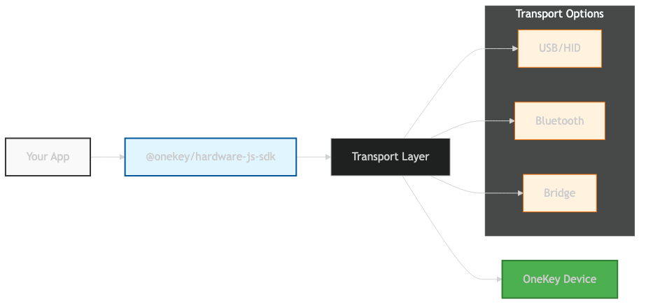

# Node.js Integration

Integrate OneKey hardware wallets into Node.js applications, desktop apps, and CLI tools with full device access and complete SDK functionality.

## Installation

```bash
npm install @onekey/hardware-js-sdk
```

## Quick Start

```javascript
const OneKeySDK = require('@onekey/hardware-js-sdk');

const sdk = new OneKeySDK({
  manifest: {
    email: 'developer@yourapp.com',
    appName: 'Your Node App',
    appUrl: 'https://yourapp.com'
  }
});

// Search and connect to device
const devices = await sdk.searchDevices();
await sdk.connectDevice(devices[0].path);

// Get Bitcoin address
const result = await sdk.btcGetAddress({
  path: "m/44'/0'/0'/0/0",
  showOnDevice: true
});

console.log('Address:', result.payload.address);
```

## Architecture



Node.js SDK provides direct device communication through multiple transport layers:

- **USB/HID** - Direct USB communication (default)
- **Bluetooth** - Wireless device connection
- **Bridge** - OneKey Bridge application proxy

## System Requirements

| Platform | Version | Notes |
|----------|---------|-------|
| **Node.js** | 16.0+ | LTS recommended |
| **Windows** | 10+ | Driver auto-install |
| **macOS** | 10.14+ | No additional setup |
| **Linux** | Ubuntu 18.04+ | Requires udev rules |

## Environment Setup

### Linux Configuration

Configure udev rules for device access:

```bash
# Create udev rules file
sudo nano /etc/udev/rules.d/51-onekey.rules
```

Add device rules:
```bash
# OneKey Classic
SUBSYSTEM=="usb", ATTR{idVendor}=="1209", ATTR{idProduct}=="53c1", MODE="0666", GROUP="plugdev"
# OneKey Touch
SUBSYSTEM=="usb", ATTR{idVendor}=="1209", ATTR{idProduct}=="53c0", MODE="0666", GROUP="plugdev"
# OneKey Pro
SUBSYSTEM=="usb", ATTR{idVendor}=="1209", ATTR{idProduct}=="53c2", MODE="0666", GROUP="plugdev"
```

Reload rules:
```bash
sudo udevadm control --reload-rules
sudo udevadm trigger
```

### macOS Configuration

Install libusb (optional, for better compatibility):
```bash
brew install libusb
```

### Windows Configuration

No additional configuration required. Drivers install automatically.

## Transport Configuration

### Automatic Transport Selection

```javascript
const sdk = new OneKeySDK({
  transport: {
    type: 'auto' // Automatically choose best transport
  },
  manifest: { /* ... */ }
});
```

### USB Transport (Default)

```javascript
const sdk = new OneKeySDK({
  transport: {
    type: 'usb',
    timeout: 5000 // Connection timeout in ms
  },
  manifest: { /* ... */ }
});
```

### Bluetooth Transport

```javascript
const sdk = new OneKeySDK({
  transport: {
    type: 'bluetooth',
    timeout: 10000 // Bluetooth discovery timeout
  },
  manifest: { /* ... */ }
});
```

### Bridge Transport

```javascript
const sdk = new OneKeySDK({
  transport: {
    type: 'bridge',
    bridgeUrl: 'http://localhost:21325' // OneKey Bridge URL
  },
  manifest: { /* ... */ }
});
```

## Device Management

### Search Devices

```javascript
// Search all available devices
const devices = await sdk.searchDevices();
console.log('Found devices:', devices.length);

// Search specific transport
const usbDevices = await sdk.searchDevices({
  transport: 'usb'
});
```

### Connect Device

```javascript
// Connect to first available device
const devices = await sdk.searchDevices();
if (devices.length > 0) {
  await sdk.connectDevice(devices[0].path);
  console.log('Connected to device');
}

// Connect to specific device
await sdk.connectDevice('/dev/hidraw0'); // Linux
await sdk.connectDevice('\\\\?\\hid#...'); // Windows
```

### Device Events

```javascript
// Listen for device events
sdk.on('device-connect', (device) => {
  console.log('Device connected:', device.path);
});

sdk.on('device-disconnect', (device) => {
  console.log('Device disconnected:', device.path);
});

sdk.on('device-changed', (device) => {
  console.log('Device state changed:', device);
});
```

## TypeScript Support

```typescript
import OneKeySDK, { 
  OneKeySDKOptions,
  SearchDevicesResponse,
  BtcGetAddressParams,
  BtcGetAddressResponse
} from '@onekey/hardware-js-sdk';

const options: OneKeySDKOptions = {
  manifest: {
    email: 'developer@yourapp.com',
    appName: 'TypeScript App',
    appUrl: 'https://yourapp.com'
  },
  transport: {
    type: 'auto'
  }
};

const sdk = new OneKeySDK(options);

// Type-safe method calls
const addressParams: BtcGetAddressParams = {
  path: "m/44'/0'/0'/0/0",
  showOnDevice: true,
  coin: 'btc'
};

const result: BtcGetAddressResponse = await sdk.btcGetAddress(addressParams);
```

## CLI Application Example

```javascript
#!/usr/bin/env node

const OneKeySDK = require('@onekey/hardware-js-sdk');
const readline = require('readline');

class OneKeyCLI {
  constructor() {
    this.sdk = new OneKeySDK({
      manifest: {
        email: 'developer@yourapp.com',
        appName: 'OneKey CLI',
        appUrl: 'https://yourapp.com'
      }
    });
    
    this.rl = readline.createInterface({
      input: process.stdin,
      output: process.stdout
    });
  }

  async init() {
    console.log('OneKey CLI Tool');
    console.log('===============');
    
    try {
      await this.connectDevice();
      await this.showMenu();
    } catch (error) {
      console.error('Error:', error.message);
      process.exit(1);
    }
  }

  async connectDevice() {
    console.log('Searching for devices...');
    const devices = await this.sdk.searchDevices();
    
    if (devices.length === 0) {
      throw new Error('No devices found. Please connect your OneKey device.');
    }
    
    await this.sdk.connectDevice(devices[0].path);
    console.log('✅ Device connected successfully\n');
  }

  async showMenu() {
    console.log('Available commands:');
    console.log('1. Get Bitcoin address');
    console.log('2. Get Ethereum address');
    console.log('3. Get device info');
    console.log('4. Exit');
    
    this.rl.question('\nSelect option (1-4): ', async (answer) => {
      switch (answer) {
        case '1':
          await this.getBitcoinAddress();
          break;
        case '2':
          await this.getEthereumAddress();
          break;
        case '3':
          await this.getDeviceInfo();
          break;
        case '4':
          console.log('Goodbye!');
          process.exit(0);
          break;
        default:
          console.log('Invalid option');
      }
      
      setTimeout(() => this.showMenu(), 1000);
    });
  }

  async getBitcoinAddress() {
    try {
      const result = await this.sdk.btcGetAddress({
        path: "m/44'/0'/0'/0/0",
        showOnDevice: true
      });
      
      if (result.success) {
        console.log('✅ Bitcoin Address:', result.payload.address);
      } else {
        console.log('❌ Error:', result.payload.error);
      }
    } catch (error) {
      console.log('❌ Error:', error.message);
    }
  }

  async getEthereumAddress() {
    try {
      const result = await this.sdk.ethereumGetAddress({
        path: "m/44'/60'/0'/0/0",
        showOnDevice: true
      });
      
      if (result.success) {
        console.log('✅ Ethereum Address:', result.payload.address);
      } else {
        console.log('❌ Error:', result.payload.error);
      }
    } catch (error) {
      console.log('❌ Error:', error.message);
    }
  }

  async getDeviceInfo() {
    try {
      const features = await this.sdk.getFeatures();
      console.log('✅ Device Info:');
      console.log(`   Model: ${features.model}`);
      console.log(`   Firmware: ${features.major_version}.${features.minor_version}.${features.patch_version}`);
      console.log(`   Device ID: ${features.device_id}`);
    } catch (error) {
      console.log('❌ Error:', error.message);
    }
  }
}

// Run CLI
const cli = new OneKeyCLI();
cli.init();
```

## Error Handling

```javascript
try {
  const devices = await sdk.searchDevices();
  await sdk.connectDevice(devices[0].path);
  
  const result = await sdk.btcGetAddress({
    path: "m/44'/0'/0'/0/0",
    showOnDevice: true
  });
  
  if (result.success) {
    console.log('Address:', result.payload.address);
  } else {
    console.error('API Error:', result.payload.error);
  }
} catch (error) {
  switch (error.code) {
    case 'Device_NotFound':
      console.error('No device found. Please connect your OneKey device.');
      break;
    case 'Device_Disconnected':
      console.error('Device disconnected. Please reconnect.');
      break;
    case 'Permission_Denied':
      console.error('Permission denied. Check udev rules on Linux.');
      break;
    case 'Transport_Missing':
      console.error('Transport not available. Install OneKey Bridge.');
      break;
    default:
      console.error('Unknown error:', error.message);
  }
}
```

## Performance Optimization

### Connection Pooling

```javascript
class OneKeyManager {
  constructor() {
    this.sdk = null;
    this.connected = false;
    this.devicePath = null;
  }

  async initialize() {
    if (!this.sdk) {
      this.sdk = new OneKeySDK({
        manifest: { /* ... */ }
      });
    }

    if (!this.connected) {
      await this.connect();
    }

    return this.sdk;
  }

  async connect() {
    const devices = await this.sdk.searchDevices();
    if (devices.length > 0) {
      this.devicePath = devices[0].path;
      await this.sdk.connectDevice(this.devicePath);
      this.connected = true;
    }
  }

  async disconnect() {
    if (this.connected) {
      await this.sdk.disconnect();
      this.connected = false;
    }
  }
}
```

### Batch Operations

```javascript
async function getBatchAddresses(sdk, paths) {
  const addresses = [];
  
  for (const path of paths) {
    try {
      const result = await sdk.btcGetAddress({
        path,
        showOnDevice: false // Don't show on device for batch operations
      });
      
      if (result.success) {
        addresses.push({
          path,
          address: result.payload.address
        });
      }
    } catch (error) {
      console.error(`Failed to get address for ${path}:`, error.message);
    }
  }
  
  return addresses;
}
```

## Best Practices

### Resource Management
- Always disconnect when application exits
- Use connection pooling for multiple operations
- Handle device disconnection gracefully

### Security
- Validate all inputs before sending to device
- Use `showOnDevice: true` for address verification
- Never log sensitive information

### Error Handling
- Implement retry logic for transient errors
- Provide user-friendly error messages
- Handle all possible error codes

## Next Steps

- [Device Management API](../api/device.md) - Complete device operations
- [Bitcoin Methods](../api/bitcoin.md) - Bitcoin-specific operations
- [Ethereum Methods](../api/ethereum.md) - Ethereum-specific operations
- [Transport Layer](../concepts/transport.md) - Deep dive into transport layer
