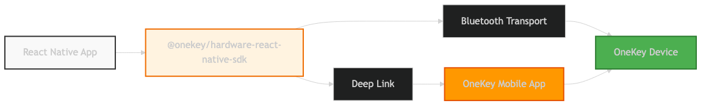

# React Native Integration

Integrate OneKey hardware wallets into React Native mobile applications with Bluetooth connectivity and deep link support.

## Installation

```bash
npm install @onekey/hardware-react-native-sdk
```

## Quick Start

```javascript
import OneKeySDK from '@onekey/hardware-react-native-sdk';
import { Linking } from 'react-native';

const sdk = new OneKeySDK({
  manifest: {
    email: 'developer@yourapp.com',
    appName: 'Your Mobile App',
    appUrl: 'https://yourapp.com'
  },
  deeplinkOpen: (url) => Linking.openURL(url),
  deeplinkCallbackUrl: 'yourapp://onekey-callback'
});

// Get Bitcoin address
const result = await sdk.btcGetAddress({
  path: "m/44'/0'/0'/0/0",
  showOnDevice: true
});

console.log('Address:', result.payload.address);
```

## Architecture



React Native SDK uses two primary connection methods:

1. **Bluetooth** - Direct device communication via Bluetooth
2. **Deep Link** - Integration with OneKey mobile app for unsupported scenarios

## Platform Setup

### iOS Configuration

Add Bluetooth permissions to `ios/YourApp/Info.plist`:

```xml
<key>NSBluetoothAlwaysUsageDescription</key>
<string>This app needs Bluetooth to connect to OneKey devices</string>
<key>NSBluetoothPeripheralUsageDescription</key>
<string>This app needs Bluetooth to connect to OneKey devices</string>
```

Configure URL scheme in `ios/YourApp/Info.plist`:

```xml
<key>CFBundleURLTypes</key>
<array>
  <dict>
    <key>CFBundleURLName</key>
    <string>yourapp</string>
    <key>CFBundleURLSchemes</key>
    <array>
      <string>yourapp</string>
    </array>
  </dict>
</array>
```

### Android Configuration

Add permissions to `android/app/src/main/AndroidManifest.xml`:

```xml
<!-- Bluetooth permissions -->
<uses-permission android:name="android.permission.BLUETOOTH" />
<uses-permission android:name="android.permission.BLUETOOTH_ADMIN" />
<uses-permission android:name="android.permission.ACCESS_COARSE_LOCATION" />
<uses-permission android:name="android.permission.ACCESS_FINE_LOCATION" />

<!-- Android 12+ permissions -->
<uses-permission android:name="android.permission.BLUETOOTH_SCAN" />
<uses-permission android:name="android.permission.BLUETOOTH_CONNECT" />
```

Configure intent filter in `android/app/src/main/AndroidManifest.xml`:

```xml
<activity
  android:name=".MainActivity"
  android:exported="true"
  android:launchMode="singleTop"
  android:theme="@style/LaunchTheme">
  
  <!-- Existing intent filters -->
  
  <!-- Deep link intent filter -->
  <intent-filter android:autoVerify="true">
    <action android:name="android.intent.action.VIEW" />
    <category android:name="android.intent.category.DEFAULT" />
    <category android:name="android.intent.category.BROWSABLE" />
    <data android:scheme="yourapp" />
  </intent-filter>
</activity>
```

## Permission Handling

### Request Bluetooth Permissions

```javascript
import { PermissionsAndroid, Platform } from 'react-native';

async function requestBluetoothPermissions() {
  if (Platform.OS === 'android') {
    const permissions = [
      PermissionsAndroid.PERMISSIONS.BLUETOOTH_SCAN,
      PermissionsAndroid.PERMISSIONS.BLUETOOTH_CONNECT,
      PermissionsAndroid.PERMISSIONS.ACCESS_FINE_LOCATION,
    ];
    
    const granted = await PermissionsAndroid.requestMultiple(permissions);
    
    const allGranted = permissions.every(
      permission => granted[permission] === PermissionsAndroid.RESULTS.GRANTED
    );
    
    if (!allGranted) {
      throw new Error('Bluetooth permissions are required');
    }
  }
}

// Use before initializing SDK
await requestBluetoothPermissions();
```

## Deep Link Integration

### Setup Deep Link Handling

```javascript
import React, { useEffect } from 'react';
import { Linking } from 'react-native';

function App() {
  useEffect(() => {
    // Handle deep links when app is running
    const subscription = Linking.addEventListener('url', handleDeepLink);
    
    // Handle deep links when app is launched
    Linking.getInitialURL().then(url => {
      if (url) {
        handleDeepLink({ url });
      }
    });
    
    return () => subscription?.remove();
  }, []);
  
  const handleDeepLink = ({ url }) => {
    if (url && url.includes('onekey-callback')) {
      sdk.handleDeeplink(url);
    }
  };
  
  return (
    // Your app components
  );
}
```

### Custom Deep Link Handler

```javascript
class DeepLinkManager {
  constructor(sdk) {
    this.sdk = sdk;
    this.subscription = null;
  }
  
  start() {
    this.subscription = Linking.addEventListener('url', this.handleDeepLink);
    
    // Handle app launch deep link
    Linking.getInitialURL().then(url => {
      if (url) {
        this.handleDeepLink({ url });
      }
    });
  }
  
  stop() {
    if (this.subscription) {
      this.subscription.remove();
      this.subscription = null;
    }
  }
  
  handleDeepLink = ({ url }) => {
    console.log('Received deep link:', url);
    
    if (url && url.includes('onekey-callback')) {
      this.sdk.handleDeeplink(url);
    }
  }
}

// Usage
const deepLinkManager = new DeepLinkManager(sdk);
deepLinkManager.start();
```

## Complete React Native Example

```javascript
import React, { useState, useEffect } from 'react';
import {
  View,
  Text,
  Button,
  Alert,
  StyleSheet,
  Linking,
  PermissionsAndroid,
  Platform
} from 'react-native';
import OneKeySDK from '@onekey/hardware-react-native-sdk';

const OneKeyWallet = () => {
  const [sdk, setSdk] = useState(null);
  const [connected, setConnected] = useState(false);
  const [address, setAddress] = useState('');
  const [loading, setLoading] = useState(false);

  useEffect(() => {
    initializeSDK();
    setupDeepLinkHandling();
    
    return () => {
      // Cleanup
    };
  }, []);

  const initializeSDK = async () => {
    try {
      // Request permissions first
      await requestPermissions();
      
      // Initialize SDK
      const sdkInstance = new OneKeySDK({
        manifest: {
          email: 'developer@yourapp.com',
          appName: 'OneKey RN Demo',
          appUrl: 'https://yourapp.com'
        },
        deeplinkOpen: (url) => {
          console.log('Opening deep link:', url);
          Linking.openURL(url);
        },
        deeplinkCallbackUrl: 'onekeydemo://onekey-callback'
      });
      
      setSdk(sdkInstance);
    } catch (error) {
      Alert.alert('Initialization Error', error.message);
    }
  };

  const requestPermissions = async () => {
    if (Platform.OS === 'android') {
      const permissions = [
        PermissionsAndroid.PERMISSIONS.BLUETOOTH_SCAN,
        PermissionsAndroid.PERMISSIONS.BLUETOOTH_CONNECT,
        PermissionsAndroid.PERMISSIONS.ACCESS_FINE_LOCATION,
      ];
      
      const granted = await PermissionsAndroid.requestMultiple(permissions);
      
      const allGranted = permissions.every(
        permission => granted[permission] === PermissionsAndroid.RESULTS.GRANTED
      );
      
      if (!allGranted) {
        throw new Error('Bluetooth permissions are required');
      }
    }
  };

  const setupDeepLinkHandling = () => {
    const subscription = Linking.addEventListener('url', ({ url }) => {
      console.log('Deep link received:', url);
      if (sdk && url.includes('onekey-callback')) {
        sdk.handleDeeplink(url);
      }
    });

    Linking.getInitialURL().then(url => {
      if (url && sdk) {
        sdk.handleDeeplink(url);
      }
    });

    return () => subscription?.remove();
  };

  const connectDevice = async () => {
    if (!sdk) return;
    
    setLoading(true);
    try {
      const features = await sdk.getFeatures();
      setConnected(true);
      Alert.alert('Success', `Connected to ${features.model}`);
    } catch (error) {
      Alert.alert('Connection Error', error.message);
    } finally {
      setLoading(false);
    }
  };

  const getAddress = async () => {
    if (!sdk) return;
    
    setLoading(true);
    try {
      const result = await sdk.btcGetAddress({
        path: "m/44'/0'/0'/0/0",
        showOnDevice: true
      });
      
      if (result.success) {
        setAddress(result.payload.address);
        Alert.alert('Success', `Address: ${result.payload.address}`);
      } else {
        Alert.alert('Error', result.payload.error);
      }
    } catch (error) {
      Alert.alert('Error', error.message);
    } finally {
      setLoading(false);
    }
  };

  const signMessage = async () => {
    if (!sdk) return;
    
    setLoading(true);
    try {
      const result = await sdk.btcSignMessage({
        path: "m/44'/0'/0'/0/0",
        message: 'Hello OneKey!',
        coin: 'btc'
      });
      
      if (result.success) {
        Alert.alert('Success', `Signature: ${result.payload.signature}`);
      } else {
        Alert.alert('Error', result.payload.error);
      }
    } catch (error) {
      Alert.alert('Error', error.message);
    } finally {
      setLoading(false);
    }
  };

  return (
    <View style={styles.container}>
      <Text style={styles.title}>OneKey React Native Demo</Text>
      
      <View style={styles.buttonContainer}>
        <Button
          title={connected ? 'Connected' : 'Connect Device'}
          onPress={connectDevice}
          disabled={loading || connected}
          color={connected ? '#28a745' : '#007bff'}
        />
        
        <Button
          title="Get Bitcoin Address"
          onPress={getAddress}
          disabled={loading || !connected}
        />
        
        <Button
          title="Sign Message"
          onPress={signMessage}
          disabled={loading || !connected}
        />
      </View>
      
      {address && (
        <View style={styles.addressContainer}>
          <Text style={styles.addressLabel}>Bitcoin Address:</Text>
          <Text style={styles.addressText}>{address}</Text>
        </View>
      )}
      
      {loading && (
        <Text style={styles.loadingText}>Processing...</Text>
      )}
    </View>
  );
};

const styles = StyleSheet.create({
  container: {
    flex: 1,
    justifyContent: 'center',
    alignItems: 'center',
    padding: 20,
    backgroundColor: '#f5f5f5',
  },
  title: {
    fontSize: 24,
    fontWeight: 'bold',
    marginBottom: 30,
    textAlign: 'center',
  },
  buttonContainer: {
    width: '100%',
    gap: 15,
  },
  addressContainer: {
    marginTop: 30,
    padding: 15,
    backgroundColor: '#e8f5e8',
    borderRadius: 8,
    width: '100%',
  },
  addressLabel: {
    fontSize: 16,
    fontWeight: 'bold',
    marginBottom: 5,
  },
  addressText: {
    fontSize: 12,
    fontFamily: 'monospace',
    color: '#333',
  },
  loadingText: {
    marginTop: 20,
    fontSize: 16,
    color: '#666',
  },
});

export default OneKeyWallet;
```

## Error Handling

```javascript
try {
  const result = await sdk.btcGetAddress({
    path: "m/44'/0'/0'/0/0",
    showOnDevice: true
  });
  
  if (result.success) {
    console.log('Address:', result.payload.address);
  } else {
    console.error('API Error:', result.payload.error);
  }
} catch (error) {
  switch (error.code) {
    case 'Device_NotFound':
      Alert.alert('Device Not Found', 'Please ensure your OneKey device is nearby and Bluetooth is enabled.');
      break;
    case 'User_Cancelled':
      Alert.alert('Cancelled', 'Operation was cancelled by user.');
      break;
    case 'Permission_Denied':
      Alert.alert('Permission Denied', 'Please grant Bluetooth permissions in device settings.');
      break;
    case 'Bluetooth_Disabled':
      Alert.alert('Bluetooth Disabled', 'Please enable Bluetooth to connect to OneKey device.');
      break;
    default:
      Alert.alert('Error', error.message);
  }
}
```

## Best Practices

### Performance
- Request permissions early in app lifecycle
- Cache SDK instance across app sessions
- Use loading states for better UX

### User Experience
- Provide clear instructions for device pairing
- Handle Bluetooth state changes gracefully
- Show appropriate error messages

### Security
- Validate deep link URLs before processing
- Use secure storage for sensitive data
- Implement proper session management

## Troubleshooting

### Bluetooth Issues
1. Ensure Bluetooth permissions are granted
2. Check if Bluetooth is enabled on device
3. Verify OneKey device is in pairing mode

### Deep Link Issues
1. Verify URL scheme configuration
2. Test deep link handling in development
3. Check OneKey mobile app installation

### Build Issues
1. Clean and rebuild project after adding permissions
2. Verify Metro configuration for new dependencies
3. Check platform-specific build settings

## Next Steps

- [Device Management API](../api/device.md) - Complete device operations
- [Bitcoin Methods](../api/bitcoin.md) - Bitcoin-specific operations
- [Ethereum Methods](../api/ethereum.md) - Ethereum-specific operations
- [Best Practices](../guides/best-practices.md) - Mobile development tips
