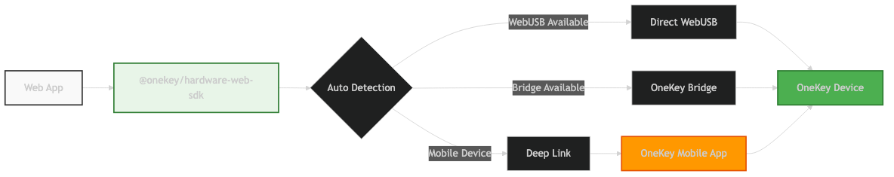

# Web Browser Integration

Integrate OneKey hardware wallets into web applications with automatic transport detection and fallback mechanisms.

## Installation

```bash
npm install @onekey/hardware-web-sdk
```

Or use CDN:

```html
<script src="https://unpkg.com/@onekey/hardware-web-sdk"></script>
```

## Quick Start

```javascript
import OneKeySDK from '@onekey/hardware-web-sdk';

const sdk = new OneKeySDK({
  manifest: {
    email: 'developer@yourapp.com',
    appName: 'Your Web App',
    appUrl: 'https://yourapp.com'
  }
});

// Get Bitcoin address
const result = await sdk.btcGetAddress({
  path: "m/44'/0'/0'/0/0",
  showOnDevice: true
});

if (result.success) {
  console.log('Address:', result.payload.address);
}
```

## Architecture



The Web SDK automatically detects and uses the best available connection method:

1. **WebUSB** - Direct browser-to-device communication (Chrome, Edge, Opera)
2. **OneKey Bridge** - Proxy application for unsupported browsers
3. **Deep Link** - Mobile device fallback via OneKey mobile app

## Browser Support

| Browser | WebUSB | Bridge | Deep Link |
|---------|--------|--------|-----------|
| Chrome 61+ | ✅ | ✅ | ✅ |
| Edge 79+ | ✅ | ✅ | ✅ |
| Firefox 55+ | ❌ | ✅ | ✅ |
| Safari 11+ | ❌ | ✅ | ✅ |
| Mobile browsers | ❌ | ❌ | ✅ |

## Configuration

### Basic Configuration

```javascript
const sdk = new OneKeySDK({
  manifest: {
    email: 'developer@yourapp.com',
    appName: 'Your Web App',
    appUrl: 'https://yourapp.com'
  },
  debug: true // Enable for development
});
```

### Custom Connect Service

```javascript
const sdk = new OneKeySDK({
  connectSrc: 'https://your-connect-service.com',
  manifest: { /* ... */ }
});
```

### Connection Mode

```javascript
const sdk = new OneKeySDK({
  mode: 'popup', // 'iframe' (default) or 'popup'
  manifest: { /* ... */ }
});
```

## Environment Requirements

### HTTPS Requirement

WebUSB requires HTTPS in production. Development on `localhost` is allowed:

```javascript
// ✅ Allowed
https://yourapp.com
https://localhost:3000
http://localhost:3000

// ❌ Not allowed
http://yourapp.com
```

### Content Security Policy

If using CSP, add these directives:

```html
<meta http-equiv="Content-Security-Policy" 
      content="connect-src 'self' https://connect.onekey.so; 
               frame-src https://connect.onekey.so;">
```

## React Integration

```jsx
import React, { useState, useEffect } from 'react';
import OneKeySDK from '@onekey/hardware-web-sdk';

function OneKeyWallet() {
  const [sdk, setSdk] = useState(null);
  const [address, setAddress] = useState('');
  const [loading, setLoading] = useState(false);

  useEffect(() => {
    const sdkInstance = new OneKeySDK({
      manifest: {
        email: 'developer@yourapp.com',
        appName: 'React Demo',
        appUrl: window.location.origin
      }
    });
    setSdk(sdkInstance);
  }, []);

  const getAddress = async () => {
    if (!sdk) return;
    
    setLoading(true);
    try {
      const result = await sdk.btcGetAddress({
        path: "m/44'/0'/0'/0/0",
        showOnDevice: true
      });
      
      if (result.success) {
        setAddress(result.payload.address);
      }
    } catch (error) {
      console.error('Error:', error);
    } finally {
      setLoading(false);
    }
  };

  return (
    <div>
      <button onClick={getAddress} disabled={loading}>
        {loading ? 'Getting Address...' : 'Get Bitcoin Address'}
      </button>
      {address && <p>Address: {address}</p>}
    </div>
  );
}
```

## Vue Integration

```vue
<template>
  <div>
    <button @click="getAddress" :disabled="loading">
      {{ loading ? 'Getting Address...' : 'Get Bitcoin Address' }}
    </button>
    <p v-if="address">Address: {{ address }}</p>
  </div>
</template>

<script>
import OneKeySDK from '@onekey/hardware-web-sdk';

export default {
  data() {
    return {
      sdk: null,
      address: '',
      loading: false
    };
  },
  
  mounted() {
    this.sdk = new OneKeySDK({
      manifest: {
        email: 'developer@yourapp.com',
        appName: 'Vue Demo',
        appUrl: window.location.origin
      }
    });
  },
  
  methods: {
    async getAddress() {
      if (!this.sdk) return;
      
      this.loading = true;
      try {
        const result = await this.sdk.btcGetAddress({
          path: "m/44'/0'/0'/0/0",
          showOnDevice: true
        });
        
        if (result.success) {
          this.address = result.payload.address;
        }
      } catch (error) {
        console.error('Error:', error);
      } finally {
        this.loading = false;
      }
    }
  }
};
</script>
```

## Error Handling

```javascript
try {
  const result = await sdk.btcGetAddress({
    path: "m/44'/0'/0'/0/0",
    showOnDevice: true
  });
  
  if (result.success) {
    console.log('Address:', result.payload.address);
  } else {
    console.error('Error:', result.payload.error);
  }
} catch (error) {
  switch (error.code) {
    case 'Transport_Missing':
      console.error('Please install OneKey Bridge or use a supported browser');
      break;
    case 'Device_NotFound':
      console.error('Please connect your OneKey device');
      break;
    case 'User_Cancelled':
      console.error('Operation cancelled by user');
      break;
    default:
      console.error('Unknown error:', error.message);
  }
}
```

## Best Practices

### Performance
- Initialize SDK once and reuse the instance
- Use connection pooling for multiple operations
- Implement proper loading states

### Security
- Always use HTTPS in production
- Validate all user inputs
- Use `showOnDevice: true` for address verification

### User Experience
- Provide clear instructions for device interactions
- Handle all error cases gracefully
- Show appropriate loading indicators

## Troubleshooting

### WebUSB Not Working
1. Ensure HTTPS is enabled
2. Check browser compatibility
3. Verify CSP configuration

### Bridge Connection Issues
1. Install OneKey Bridge application
2. Check if Bridge service is running
3. Verify firewall settings

### Mobile Device Issues
1. Ensure OneKey mobile app is installed
2. Configure proper deep link handling
3. Test deep link URL scheme

## Next Steps

- [API Reference](../api/init.md) - Complete method documentation
- [Bitcoin Methods](../api/bitcoin.md) - Bitcoin-specific operations
- [Ethereum Methods](../api/ethereum.md) - Ethereum-specific operations
- [Best Practices](../guides/best-practices.md) - Security and performance tips
