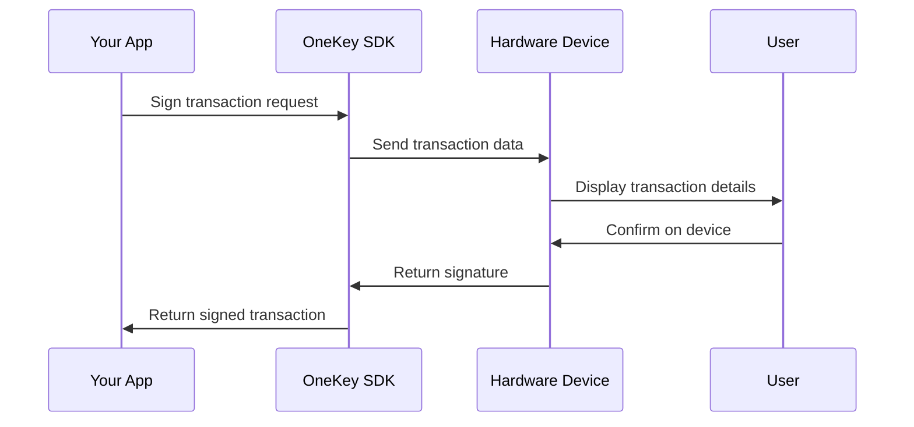

# Core Concepts

Understanding the fundamental concepts behind OneKey Hardware SDK will help you build better integrations and troubleshoot issues more effectively.

## Architecture Overview

OneKey Hardware SDK uses a layered architecture that provides a consistent API across different platforms while handling the complexities of hardware communication.

```mermaid
graph TB
    A[Your Application] --> B[SDK Layer]
    B --> C[Transport Layer]
    C --> D[Hardware Device]
    
    B1[@onekeyfe/hd-web-sdk] --> B
    B2[@onekeyfe/hd-common-connect-sdk] --> B
    B3[@onekeyfe/hd-ble-sdk] --> B
    
    C1[WebUSB] --> C
    C2[HTTP Bridge] --> C
    C3[Bluetooth] --> C
    C4[USB/HID] --> C
```

### SDK Layer

The SDK layer provides a unified API that abstracts platform differences:

- **`@onekeyfe/hd-web-sdk`** - Web browsers with iframe isolation
- **`@onekeyfe/hd-common-connect-sdk`** - Node.js and Electron applications
- **`@onekeyfe/hd-ble-sdk`** - React Native mobile applications

### Transport Layer

The transport layer handles different communication methods:

- **WebUSB** - Direct browser-to-device communication
- **USB/HID** - Direct USB communication (Node.js)
- **Bluetooth** - Wireless communication (mobile/desktop)
- **HTTP Bridge** - OneKey Bridge application proxy

### Hardware Layer

OneKey hardware devices that store private keys and perform cryptographic operations.

## Key Concepts

### Device Management

#### Device Discovery

```javascript
// Search for available devices
const devices = await HardwareSDK.searchDevices();

// Each device object contains:
// {
//   path: 'unique-device-identifier',
//   label: 'user-defined-name',
//   features: { ... device capabilities ... }
// }
```

#### Device Connection

```javascript
// Connect to a specific device
await HardwareSDK.connectDevice(device.path);

// The SDK maintains the connection state
// and handles reconnection automatically
```

### Derivation Paths

OneKey uses BIP-44 hierarchical deterministic (HD) wallet structure:

```
m / purpose' / coin_type' / account' / change / address_index
```

#### Common Path Examples

```javascript
// Bitcoin addresses
"m/44'/0'/0'/0/0"    // First Bitcoin receiving address
"m/44'/0'/0'/1/0"    // First Bitcoin change address
"m/44'/0'/1'/0/0"    // Second Bitcoin account

// Ethereum addresses
"m/44'/60'/0'/0/0"   // First Ethereum address
"m/44'/60'/1'/0/0"   // Second Ethereum account

// Other cryptocurrencies
"m/44'/2'/0'/0/0"    // Litecoin
"m/44'/145'/0'/0/0"  // Bitcoin Cash
```

### Transaction Signing

#### Security Model

1. **Private keys never leave the device**
2. **User confirmation required for all operations**
3. **Transaction details displayed on device screen**
4. **Cryptographic verification of all data**

#### Signing Process



### Event System

The SDK uses an event-driven architecture for handling device interactions:

```javascript
// Device connection events
HardwareSDK.on('device-connect', (device) => {
    console.log('Device connected:', device);
});

HardwareSDK.on('device-disconnect', (device) => {
    console.log('Device disconnected:', device);
});

// User interaction events
HardwareSDK.on('ui-button', (event) => {
    console.log('Please confirm action on device');
});

HardwareSDK.on('ui-request_pin', (event) => {
    // Handle PIN entry request
    const pin = prompt('Enter PIN:');
    HardwareSDK.uiResponse({ type: 'ui-receive_pin', payload: pin });
});
```

### Error Handling

#### Error Types

1. **Transport Errors** - Connection and communication issues
2. **Device Errors** - Hardware-specific errors
3. **User Errors** - User cancellation or invalid input
4. **Protocol Errors** - Invalid parameters or unsupported operations

#### Error Response Format

```javascript
{
    success: false,
    payload: {
        error: 'ERROR_CODE',
        code: 'DEVICE_NOT_FOUND',
        message: 'Human readable error message'
    }
}
```

### Security Considerations

#### Manifest Verification

Your application must provide a manifest that identifies it to the device:

```javascript
const manifest = {
    email: 'developer@yourapp.com',    // Contact email
    appName: 'Your Application Name',  // Display name
    appUrl: 'https://yourapp.com'      // Application URL
};
```

#### Address Verification

Always verify addresses on the device screen:

```javascript
const result = await HardwareSDK.btcGetAddress({
    path: "m/44'/0'/0'/0/0",
    showOnDevice: true,  // Always set to true for verification
    coin: 'btc'
});
```

#### Transaction Verification

Users must confirm all transaction details on the device:

- Recipient address
- Amount being sent
- Transaction fees
- Any additional data

## SDK Packages Deep Dive

### Web SDK (@onekeyfe/hd-web-sdk)

**Use Cases:**
- Web applications
- Browser extensions
- Progressive Web Apps (PWAs)

**Key Features:**
- Iframe isolation for security
- WebUSB support
- CORS handling
- CSP compatibility

**Limitations:**
- Requires HTTPS in production
- Limited to WebUSB transport
- Browser permission requirements

### Node.js SDK (@onekeyfe/hd-common-connect-sdk)

**Use Cases:**
- Desktop applications
- CLI tools
- Server-side applications
- Electron apps

**Key Features:**
- Direct USB/HID communication
- HTTP Bridge support
- Full filesystem access
- No browser limitations

**Limitations:**
- Requires native dependencies
- Platform-specific builds

### React Native SDK (@onekeyfe/hd-ble-sdk)

**Use Cases:**
- Mobile applications
- Cross-platform mobile apps

**Key Features:**
- Bluetooth Low Energy (BLE) support
- Deep link integration
- Mobile-optimized UI flows
- Platform permissions handling

**Limitations:**
- Requires Bluetooth permissions
- iOS/Android specific setup
- Limited to BLE transport

## Best Practices

### Initialization

```javascript
// Initialize once at application startup
let sdkInitialized = false;

async function initializeSDK() {
    if (sdkInitialized) return;
    
    await HardwareSDK.init({
        debug: process.env.NODE_ENV === 'development',
        manifest: {
            email: 'developer@yourapp.com',
            appName: 'Your App',
            appUrl: 'https://yourapp.com'
        }
    });
    
    sdkInitialized = true;
}
```

### Connection Management

```javascript
class DeviceManager {
    constructor() {
        this.device = null;
        this.isConnected = false;
    }
    
    async connect() {
        const devices = await HardwareSDK.searchDevices();
        if (devices.length === 0) {
            throw new Error('No devices found');
        }
        
        await HardwareSDK.connectDevice(devices[0].path);
        this.device = devices[0];
        this.isConnected = true;
    }
    
    async ensureConnected() {
        if (!this.isConnected) {
            await this.connect();
        }
    }
}
```

### Error Handling

```javascript
async function safeOperation(operation) {
    try {
        const result = await operation();
        
        if (result.success) {
            return result.payload;
        } else {
            throw new Error(result.payload.error);
        }
    } catch (error) {
        console.error('Operation failed:', error.message);
        throw error;
    }
}
```

## Next Steps

- [Web SDK](web-sdk.md) - Web browser integration
- [Node.js SDK](nodejs-sdk.md) - Desktop and server applications
- [React Native SDK](react-native-sdk.md) - Mobile applications
- [Transport Layer](transport.md) - Communication protocols
