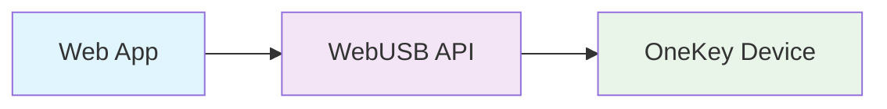
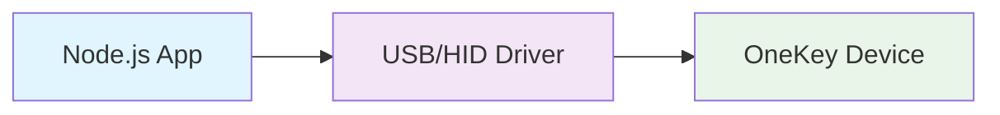
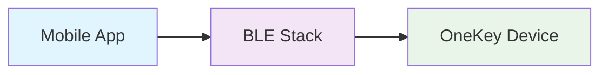
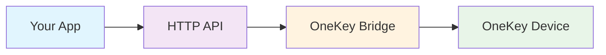

# Transport Layer

The transport layer handles communication between your application and OneKey hardware devices through various connection methods. Understanding the transport layer helps you choose the right connection method and troubleshoot connectivity issues.

## Transport Types

OneKey SDK supports multiple transport methods, each optimized for different environments and use cases:

| Transport | Environment | Connection | Pros | Cons |
|-----------|-------------|------------|------|------|
| **WebUSB** | Web Browser | USB | Direct, fast, secure | Browser support limited |
| **USB/HID** | Node.js/Electron | USB | Full control, reliable | Platform dependencies |
| **Bluetooth** | Mobile/Desktop | BLE | Wireless, convenient | Range limited, pairing required |
| **HTTP Bridge** | Any | USB via Bridge | Universal compatibility | Requires Bridge app |

## WebUSB Transport

### Overview

WebUSB enables direct communication between web browsers and USB devices without requiring additional software.



### Browser Support

- Chrome 61+
- Edge 79+
- Opera 48+
- Chrome for Android 61+

### Requirements

- HTTPS connection (except localhost)
- User gesture for device access
- Device permissions granted

### Implementation

```javascript
// Web SDK automatically uses WebUSB
import { HardwareSDK } from '@onekeyfe/hd-web-sdk';

await HardwareSDK.init({
    connectSrc: 'https://jssdk.onekey.so/',
    manifest: { /* ... */ }
});

// Device discovery triggers permission request
const devices = await HardwareSDK.searchDevices();
```

### Permission Handling

```javascript
// Check WebUSB support
if (!navigator.usb) {
    console.error('WebUSB not supported');
}

// Listen for permission events
navigator.usb.addEventListener('connect', (event) => {
    console.log('Device connected:', event.device);
});

navigator.usb.addEventListener('disconnect', (event) => {
    console.log('Device disconnected:', event.device);
});
```

## USB/HID Transport

### Overview

Direct USB communication through Node.js native modules, providing full control and reliability.



### Platform Support

- Windows (requires driver)
- macOS (native support)
- Linux (udev rules required)

### Implementation

```javascript
// Node.js SDK automatically uses USB/HID
const { HardwareSDK } = require('@onekeyfe/hd-common-connect-sdk');

await HardwareSDK.init({
    transport: {
        type: 'usb'
    },
    manifest: { /* ... */ }
});

const devices = await HardwareSDK.searchDevices();
```

### Linux Setup

Create udev rules for device access:

```bash
# Create udev rule file
sudo nano /etc/udev/rules.d/51-onekey.rules

# Add OneKey device rules
SUBSYSTEM=="usb", ATTR{idVendor}=="1209", ATTR{idProduct}=="53c1", MODE="0666", GROUP="plugdev"
SUBSYSTEM=="usb", ATTR{idVendor}=="1209", ATTR{idProduct}=="53c0", MODE="0666", GROUP="plugdev"

# Reload udev rules
sudo udevadm control --reload-rules
sudo udevadm trigger
```

## Bluetooth Transport

### Overview

Wireless communication using Bluetooth Low Energy (BLE) for mobile and desktop applications.



### Platform Support

- iOS 10+
- Android 5.0+
- Windows 10+
- macOS 10.12+
- Linux (BlueZ)

### Implementation

```javascript
// React Native SDK uses BLE
import { HardwareSDK } from '@onekeyfe/hd-ble-sdk';

await HardwareSDK.init({
    manifest: { /* ... */ },
    deeplinkOpen: (url) => Linking.openURL(url),
    deeplinkCallbackUrl: 'yourapp://onekey-callback'
});

// BLE device discovery
const devices = await HardwareSDK.searchDevices();
```

### BLE Characteristics

OneKey devices use standard BLE characteristics:

- **Service UUID**: `00000001-1212-efde-1523-785feabcd123`
- **Write Characteristic**: `00000002-1212-efde-1523-785feabcd123`
- **Notify Characteristic**: `00000003-1212-efde-1523-785feabcd123`

## HTTP Bridge Transport

### Overview

Communication through OneKey Bridge application, which acts as a proxy between your application and the device.



### Bridge Installation

Download and install OneKey Bridge from [onekey.so](https://onekey.so/download).

### Implementation

```javascript
// Configure Bridge transport
await HardwareSDK.init({
    transport: {
        type: 'bridge',
        bridgeUrl: 'http://localhost:21325'
    },
    manifest: { /* ... */ }
});

// Bridge handles device discovery
const devices = await HardwareSDK.searchDevices();
```

### Bridge API

Direct Bridge API access (advanced usage):

```javascript
// Check Bridge status
const response = await fetch('http://localhost:21325/');
const status = await response.json();
console.log('Bridge version:', status.version);

// List devices
const devicesResponse = await fetch('http://localhost:21325/enumerate');
const devices = await devicesResponse.json();
```

## Transport Configuration

### Automatic Transport Selection

The SDK automatically selects the best available transport:

```javascript
// SDK chooses transport based on environment
await HardwareSDK.init({
    manifest: { /* ... */ }
    // Transport auto-detected:
    // - WebUSB in browsers
    // - USB/HID in Node.js
    // - BLE in React Native
});
```

### Manual Transport Selection

```javascript
// Force specific transport
await HardwareSDK.init({
    transport: {
        type: 'bridge',              // 'usb', 'webusb', 'ble', 'bridge'
        bridgeUrl: 'http://localhost:21325',  // Bridge URL
        timeout: 30000,              // Connection timeout
        retries: 3                   // Retry attempts
    },
    manifest: { /* ... */ }
});
```

### Transport Fallback

```javascript
// Try multiple transports
const transports = ['usb', 'bridge'];

for (const transportType of transports) {
    try {
        await HardwareSDK.init({
            transport: { type: transportType },
            manifest: { /* ... */ }
        });
        
        const devices = await HardwareSDK.searchDevices();
        if (devices.length > 0) {
            console.log(`Connected via ${transportType}`);
            break;
        }
    } catch (error) {
        console.log(`${transportType} transport failed:`, error.message);
    }
}
```

## Connection Management

### Connection States

```javascript
// Monitor connection state
HardwareSDK.on('transport-connect', () => {
    console.log('Transport connected');
});

HardwareSDK.on('transport-disconnect', () => {
    console.log('Transport disconnected');
});

HardwareSDK.on('transport-error', (error) => {
    console.error('Transport error:', error);
});
```

### Reconnection Handling

```javascript
// Enable automatic reconnection
await HardwareSDK.init({
    transportReconnect: true,        // Enable auto-reconnect
    pendingTransportEvent: true,     // Handle pending events
    manifest: { /* ... */ }
});

// Manual reconnection
const reconnect = async () => {
    try {
        await HardwareSDK.dispose();
        await HardwareSDK.init({ /* config */ });
        
        const devices = await HardwareSDK.searchDevices();
        if (devices.length > 0) {
            await HardwareSDK.connectDevice(devices[0].path);
        }
    } catch (error) {
        console.error('Reconnection failed:', error);
    }
};
```

### Connection Pooling

```javascript
class TransportManager {
    constructor() {
        this.connections = new Map();
        this.activeTransport = null;
    }
    
    async getConnection(transportType) {
        if (this.connections.has(transportType)) {
            return this.connections.get(transportType);
        }
        
        const connection = await this.createConnection(transportType);
        this.connections.set(transportType, connection);
        return connection;
    }
    
    async createConnection(transportType) {
        await HardwareSDK.init({
            transport: { type: transportType },
            manifest: { /* ... */ }
        });
        
        return {
            type: transportType,
            connected: true,
            lastUsed: Date.now()
        };
    }
    
    async switchTransport(newType) {
        if (this.activeTransport !== newType) {
            await HardwareSDK.dispose();
            await this.getConnection(newType);
            this.activeTransport = newType;
        }
    }
}
```

## Performance Optimization

### Transport Selection Strategy

```javascript
const selectOptimalTransport = async () => {
    // Priority order based on performance and reliability
    const transportPriority = [
        'usb',      // Fastest, most reliable
        'webusb',   // Fast, browser-native
        'ble',      // Wireless convenience
        'bridge'    // Universal compatibility
    ];
    
    for (const transport of transportPriority) {
        if (await isTransportAvailable(transport)) {
            return transport;
        }
    }
    
    throw new Error('No transport available');
};

const isTransportAvailable = async (transport) => {
    switch (transport) {
        case 'usb':
            return typeof require !== 'undefined';
        case 'webusb':
            return typeof navigator !== 'undefined' && navigator.usb;
        case 'ble':
            return typeof navigator !== 'undefined' && navigator.bluetooth;
        case 'bridge':
            try {
                const response = await fetch('http://localhost:21325/');
                return response.ok;
            } catch {
                return false;
            }
        default:
            return false;
    }
};
```

### Connection Caching

```javascript
// Cache successful connections
const connectionCache = {
    lastSuccessfulTransport: null,
    lastConnectedDevice: null,
    
    save(transport, device) {
        this.lastSuccessfulTransport = transport;
        this.lastConnectedDevice = device;
        localStorage.setItem('onekey_transport', JSON.stringify({
            transport,
            device: device.path,
            timestamp: Date.now()
        }));
    },
    
    load() {
        try {
            const cached = JSON.parse(localStorage.getItem('onekey_transport'));
            if (cached && Date.now() - cached.timestamp < 24 * 60 * 60 * 1000) {
                return cached;
            }
        } catch (error) {
            console.log('Failed to load cached connection');
        }
        return null;
    }
};
```

## Troubleshooting

### Common Transport Issues

**WebUSB not working:**
- Ensure HTTPS connection
- Check browser support
- Grant device permissions

**USB/HID connection failed:**
- Install device drivers (Windows)
- Set up udev rules (Linux)
- Check device permissions

**BLE connection timeout:**
- Enable Bluetooth
- Grant location permissions (Android)
- Ensure device is in pairing mode

**Bridge not responding:**
- Install OneKey Bridge
- Check Bridge is running
- Verify port 21325 is available

### Debug Transport Issues

```javascript
// Enable transport debugging
await HardwareSDK.init({
    debug: true,
    logLevel: 'debug',
    manifest: { /* ... */ }
});

// Monitor transport events
HardwareSDK.on('transport-debug', (event) => {
    console.log('Transport debug:', event);
});
```

## Next Steps

- [Events & Error Handling](events-errors.md) - Event system and error handling
- [Integration Guides](../integration/web-browser.md) - Platform-specific integration
- [API Reference](../api/device.md) - Complete API documentation
- [Troubleshooting](../resources/troubleshooting.md) - Common issues and solutions
