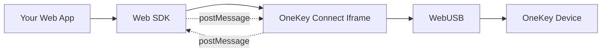

# Web SDK

The OneKey Web SDK (`@onekeyfe/hd-web-sdk`) enables secure hardware wallet integration in web browsers through an iframe-based architecture that provides isolation and security.

## Overview

The Web SDK is designed specifically for browser environments and provides:

- **Iframe Isolation** - Secure communication through isolated iframe
- **WebUSB Support** - Direct browser-to-device communication
- **CORS Handling** - Automatic cross-origin request management
- **CSP Compatibility** - Works with Content Security Policy restrictions

## Installation

```bash
npm install @onekeyfe/hd-web-sdk
# or
yarn add @onekeyfe/hd-web-sdk
```

## Basic Setup

### ES6 Modules

```javascript
import { HardwareSDK } from '@onekeyfe/hd-web-sdk';

await HardwareSDK.init({
    debug: false,
    connectSrc: 'https://jssdk.onekey.so/',
    manifest: {
        email: 'developer@yourapp.com',
        appName: 'Your Web App',
        appUrl: 'https://yourapp.com'
    }
});
```

### Script Tag

```html
<script src="https://unpkg.com/@onekeyfe/hd-web-sdk/dist/index.js"></script>
<script>
    OneKeyWebSDK.init({
        debug: false,
        connectSrc: 'https://jssdk.onekey.so/',
        manifest: {
            email: 'developer@yourapp.com',
            appName: 'Your Web App',
            appUrl: 'https://yourapp.com'
        }
    });
</script>
```

## Configuration Options

### Required Configuration

```javascript
await HardwareSDK.init({
    // Required: OneKey Connect iframe source
    connectSrc: 'https://jssdk.onekey.so/',
    
    // Required: Application manifest
    manifest: {
        email: 'developer@yourapp.com',
        appName: 'Your Application',
        appUrl: 'https://yourapp.com'
    }
});
```

### Optional Configuration

```javascript
await HardwareSDK.init({
    // Basic configuration
    debug: true,                    // Enable debug logging
    lazyLoad: true,                // Load iframe on first use
    
    // Transport settings
    transportReconnect: true,       // Auto-reconnect on disconnect
    pendingTransportEvent: true,    // Handle pending events
    
    // UI customization
    popup: false,                   // Use iframe instead of popup
    webusb: true,                   // Enable WebUSB transport
    
    // Security settings
    trustedHost: false,             // Disable host verification
    connectSrc: 'https://jssdk.onekey.so/',
    
    // Application manifest
    manifest: {
        email: 'developer@yourapp.com',
        appName: 'Your Web App',
        appUrl: 'https://yourapp.com'
    }
});
```

## Architecture

### Iframe Communication

The Web SDK uses an iframe to isolate OneKey Connect from your application:



### Security Benefits

1. **Isolation** - Connect runs in a separate origin
2. **CSP Compliance** - No inline scripts or eval()
3. **Permission Management** - WebUSB permissions handled by iframe
4. **Code Integrity** - Connect code served from trusted CDN

## WebUSB Integration

### Browser Support

WebUSB is supported in:
- Chrome 61+
- Edge 79+
- Opera 48+
- Chrome for Android 61+

### Permissions

WebUSB requires user gesture and HTTPS:

```javascript
// Must be called from user interaction (click, etc.)
document.getElementById('connect-btn').addEventListener('click', async () => {
    try {
        const devices = await HardwareSDK.searchDevices();
        if (devices.length > 0) {
            await HardwareSDK.connectDevice(devices[0].path);
        }
    } catch (error) {
        console.error('Connection failed:', error);
    }
});
```

### HTTPS Requirement

WebUSB only works over HTTPS in production:

```javascript
// Development (localhost is allowed)
const isDevelopment = location.hostname === 'localhost' || 
                     location.hostname === '127.0.0.1';

// Production requires HTTPS
const isSecure = location.protocol === 'https:';

if (!isDevelopment && !isSecure) {
    console.error('WebUSB requires HTTPS in production');
}
```

## Event Handling

### Device Events

```javascript
// Device connection events
HardwareSDK.on('device-connect', (device) => {
    console.log('Device connected:', device.label);
    updateUI({ connected: true, device });
});

HardwareSDK.on('device-disconnect', (device) => {
    console.log('Device disconnected');
    updateUI({ connected: false });
});

// Device changed events
HardwareSDK.on('device-changed', (device) => {
    console.log('Device state changed:', device);
});
```

### UI Events

```javascript
// Button confirmation requests
HardwareSDK.on('ui-button', (event) => {
    showMessage('Please confirm action on your OneKey device');
});

// PIN entry requests
HardwareSDK.on('ui-request_pin', (event) => {
    const pin = prompt('Enter PIN:');
    HardwareSDK.uiResponse({
        type: 'ui-receive_pin',
        payload: pin
    });
});

// Passphrase requests
HardwareSDK.on('ui-request_passphrase', (event) => {
    const passphrase = prompt('Enter passphrase:');
    HardwareSDK.uiResponse({
        type: 'ui-receive_passphrase',
        payload: {
            value: passphrase,
            save: false
        }
    });
});
```

## Common Patterns

### React Integration

```jsx
import React, { useState, useEffect } from 'react';
import { HardwareSDK } from '@onekeyfe/hd-web-sdk';

function OneKeyWallet() {
    const [isInitialized, setIsInitialized] = useState(false);
    const [device, setDevice] = useState(null);
    const [address, setAddress] = useState('');

    useEffect(() => {
        initializeSDK();
    }, []);

    const initializeSDK = async () => {
        try {
            await HardwareSDK.init({
                debug: process.env.NODE_ENV === 'development',
                connectSrc: 'https://jssdk.onekey.so/',
                manifest: {
                    email: 'developer@yourapp.com',
                    appName: 'React OneKey App',
                    appUrl: window.location.origin
                }
            });

            // Setup event listeners
            HardwareSDK.on('device-connect', setDevice);
            HardwareSDK.on('device-disconnect', () => setDevice(null));

            setIsInitialized(true);
        } catch (error) {
            console.error('SDK initialization failed:', error);
        }
    };

    const connectDevice = async () => {
        try {
            const devices = await HardwareSDK.searchDevices();
            if (devices.length > 0) {
                await HardwareSDK.connectDevice(devices[0].path);
            }
        } catch (error) {
            console.error('Connection failed:', error);
        }
    };

    const getAddress = async () => {
        try {
            const result = await HardwareSDK.btcGetAddress({
                path: "m/44'/0'/0'/0/0",
                showOnDevice: true,
                coin: 'btc'
            });

            if (result.success) {
                setAddress(result.payload.address);
            }
        } catch (error) {
            console.error('Get address failed:', error);
        }
    };

    return (
        <div>
            <h1>OneKey Wallet Integration</h1>
            
            {!isInitialized && <p>Initializing SDK...</p>}
            
            {isInitialized && !device && (
                <button onClick={connectDevice}>Connect OneKey</button>
            )}
            
            {device && (
                <div>
                    <p>Connected: {device.label}</p>
                    <button onClick={getAddress}>Get Bitcoin Address</button>
                    {address && <p>Address: {address}</p>}
                </div>
            )}
        </div>
    );
}

export default OneKeyWallet;
```

### Vue.js Integration

```vue
<template>
    <div>
        <h1>OneKey Wallet</h1>
        
        <button v-if="!device" @click="connectDevice">
            Connect OneKey
        </button>
        
        <div v-if="device">
            <p>Connected: {{ device.label }}</p>
            <button @click="getAddress">Get Address</button>
            <p v-if="address">Address: {{ address }}</p>
        </div>
    </div>
</template>

<script>
import { HardwareSDK } from '@onekeyfe/hd-web-sdk';

export default {
    data() {
        return {
            device: null,
            address: ''
        };
    },
    
    async mounted() {
        await this.initializeSDK();
    },
    
    methods: {
        async initializeSDK() {
            await HardwareSDK.init({
                debug: process.env.NODE_ENV === 'development',
                connectSrc: 'https://jssdk.onekey.so/',
                manifest: {
                    email: 'developer@yourapp.com',
                    appName: 'Vue OneKey App',
                    appUrl: window.location.origin
                }
            });

            HardwareSDK.on('device-connect', (device) => {
                this.device = device;
            });

            HardwareSDK.on('device-disconnect', () => {
                this.device = null;
            });
        },
        
        async connectDevice() {
            try {
                const devices = await HardwareSDK.searchDevices();
                if (devices.length > 0) {
                    await HardwareSDK.connectDevice(devices[0].path);
                }
            } catch (error) {
                console.error('Connection failed:', error);
            }
        },
        
        async getAddress() {
            try {
                const result = await HardwareSDK.btcGetAddress({
                    path: "m/44'/0'/0'/0/0",
                    showOnDevice: true,
                    coin: 'btc'
                });

                if (result.success) {
                    this.address = result.payload.address;
                }
            } catch (error) {
                console.error('Get address failed:', error);
            }
        }
    }
};
</script>
```

## Troubleshooting

### Common Issues

**"Failed to load iframe":**
- Check that `connectSrc` URL is accessible
- Verify CORS settings
- Ensure HTTPS in production

**"WebUSB not supported":**
- Use a supported browser (Chrome, Edge, Opera)
- Ensure HTTPS connection
- Check browser permissions

**"Device not found":**
- Connect device via USB
- Unlock the device
- Grant WebUSB permissions when prompted

### Content Security Policy

If using CSP, add these directives:

```html
<meta http-equiv="Content-Security-Policy" content="
    default-src 'self';
    frame-src https://jssdk.onekey.so;
    connect-src https://jssdk.onekey.so;
    script-src 'self' 'unsafe-inline';
">
```

### Development vs Production

```javascript
const config = {
    debug: process.env.NODE_ENV === 'development',
    connectSrc: process.env.NODE_ENV === 'development' 
        ? 'http://localhost:8088/' 
        : 'https://jssdk.onekey.so/',
    manifest: {
        email: 'developer@yourapp.com',
        appName: 'Your App',
        appUrl: process.env.NODE_ENV === 'development'
            ? 'http://localhost:3000'
            : 'https://yourapp.com'
    }
};
```

## Next Steps

- [Node.js SDK](nodejs-sdk.md) - Desktop applications
- [React Native SDK](react-native-sdk.md) - Mobile applications
- [Integration Guide](../integration/web-browser.md) - Detailed web integration
- [API Reference](../api/device.md) - Complete API documentation
